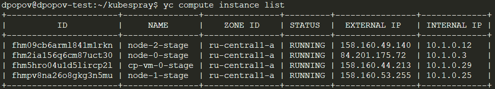
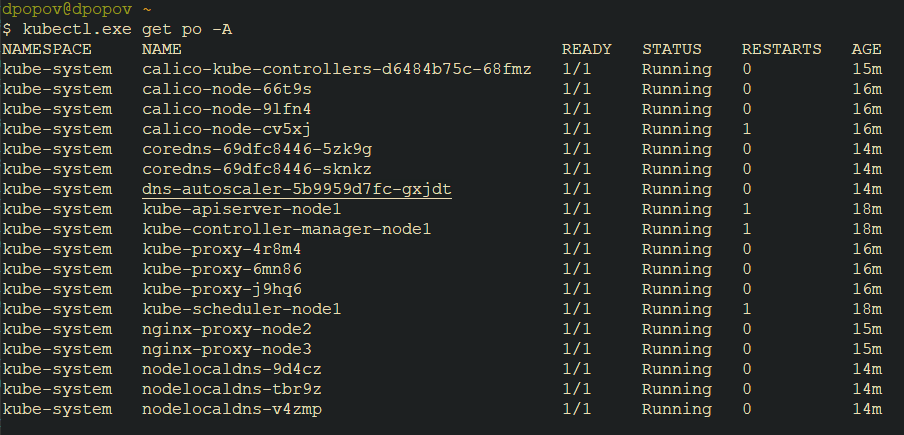

### Этап второй - Создание Kubernetes кластера

На данном этапе необходимо развернуть `Kubernetes` кластер, для данной задачи я буду использовать `Kubespray`

1. Клонирую `kubespray` командой `git clone https://github.com/kubernetes-sigs/kubespray`
2. Создаю конфигурацию своего кластера:

```shell
cd kubespray
cp inventory/sample inventory/netology
```

3. Выясняю айпи машин кластера на которые буду производить установку:



4. Для установки необходимо указать конфигурацию кластера.

```shell
nano inventory/netology/hosts.yaml

all:
  hosts:
    node1:
      ansible_host: 158.160.44.213
      ip: 10.1.0.29
      ansible_user: ubuntu
      kubeconfig_localhost: true
    node2:
      ansible_host: 84.201.175.72
      ip: 10.1.0.3
      ansible_user: ubuntu
    node3:
      ansible_host: 158.160.53.255
      ip: 10.1.0.25
      ansible_user: ubuntu
    node3:
      ansible_host: 158.160.49.140
      ip: 10.1.0.12
      ansible_user: ubuntu
  children:
    kube_control_plane:
      hosts:
        node1:
    kube_node:
      hosts:
        node2:
        node3:
        node3:
    etcd:
      hosts:
        node1:
    k8s_cluster:
      children:
        kube_control_plane:
        kube_node:
    calico_rr:
      hosts: {}
```

5. Также необходимо предусмотреть генерацию сертификата для работы `cubectl`, укажем адрес управляющей ноды:

```shell
nano inventory/netology/group_vars/k8s_cluster/k8s-cluster.yml

supplementary_addresses_in_ssl_keys: [158.160.44.213]
```

6. После развертывания кластера скопируем локально в `.kube/config` файл конфигурации кластера Кубернетес `.kube/config` с управляющей ноды

7. Проверим подключение к кластеру `Kubernetes`




## Итог: кластер `Kubernetes` запущен и работает


### Создание Kubernetes кластера

На этом этапе необходимо создать [Kubernetes](https://kubernetes.io/ru/docs/concepts/overview/what-is-kubernetes/) кластер на базе предварительно созданной инфраструктуры.   Требуется обеспечить доступ к ресурсам из Интернета.

Это можно сделать двумя способами:

1. Рекомендуемый вариант: самостоятельная установка Kubernetes кластера.  
   а. При помощи Terraform подготовить как минимум 3 виртуальных машины Compute Cloud для создания Kubernetes-кластера. Тип виртуальной машины следует выбрать самостоятельно с учётом требовании к производительности и стоимости. Если в дальнейшем поймете, что необходимо сменить тип инстанса, используйте Terraform для внесения изменений.  
   б. Подготовить [ansible](https://www.ansible.com/) конфигурации, можно воспользоваться, например [Kubespray](https://kubernetes.io/docs/setup/production-environment/tools/kubespray/)  
   в. Задеплоить Kubernetes на подготовленные ранее инстансы, в случае нехватки каких-либо ресурсов вы всегда можете создать их при помощи Terraform.
2. Альтернативный вариант: воспользуйтесь сервисом [Yandex Managed Service for Kubernetes](https://cloud.yandex.ru/services/managed-kubernetes)  
  а. С помощью terraform resource для [kubernetes](https://registry.terraform.io/providers/yandex-cloud/yandex/latest/docs/resources/kubernetes_cluster) создать региональный мастер kubernetes с размещением нод в разных 3 подсетях      
  б. С помощью terraform resource для [kubernetes node group](https://registry.terraform.io/providers/yandex-cloud/yandex/latest/docs/resources/kubernetes_node_group)
  
Ожидаемый результат:

1. Работоспособный Kubernetes кластер.
2. В файле `~/.kube/config` находятся данные для доступа к кластеру.
3. Команда `kubectl get pods --all-namespaces` отрабатывает без ошибок.

---