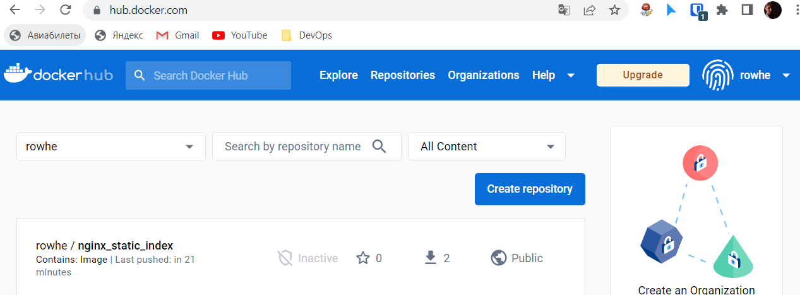

### Этап третий - подготовка тестового приложения

1. Создаем [`Dockerfile`](docker/Dockerfile) с простой конфигураций сервера `nginx` отдающим статическую страницу c именем хоста(контейнера).

```text
FROM nginx:alpine

COPY default.conf /etc/nginx/conf.d/
COPY index.html /usr/share/nginx/html/

CMD ["nginx", "-g", "daemon off;"]
```

2. Также добавляем в репозиторий файл конфигурации [`default.conf`](docker/default.conf) и файл [`index.html`](docker/index.html)

3. Далее следует собрать образ и отправить его в registry DockerHub

```shell
$ cd docker
$ docker build -t rowhe/nginx_static_index:0.0.2 .

Sending build context to Docker daemon  4.096kB
Step 1/4 : FROM nginx:alpine
alpine: Pulling from library/nginx
63b65145d645: Pull complete
51f129e7c3f1: Pull complete
f32490ce40c5: Pull complete
d18f1b67600c: Pull complete
b793aaf052d0: Pull complete
10b0102e5979: Pull complete
ec50f2776186: Pull complete
Digest: sha256:ff07dba791a114f5d944c8455e8236ca4b184bfd8d21d90b7755a4ba0a119b06
Status: Downloaded newer image for nginx:alpine
 ---> fddf8c2fcb06
Step 2/4 : COPY default.conf /etc/nginx/conf.d/
 ---> 76d6eac0e768
Step 3/4 : COPY index.html /usr/share/nginx/html/
 ---> 9d9f6ac461fe
Step 4/4 : CMD ["nginx", "-g", "daemon off;"]
 ---> Running in 9bea7252bf6f
Removing intermediate container 9bea7252bf6f
 ---> 4f80752a2eb2
Successfully built 4f80752a2eb2
Successfully tagged rowhe/nginx_static_idex:0.0.2
```


```shell
$ docker push rowhe/nginx_static_index

The push refers to repository [docker.io/rowhe/nginx_static_index]
f0756d312c74: Pushed
175495e4dc90: Pushed
a7fcaf3114d5: Mounted from library/nginx
dff076fb6916: Mounted from library/nginx
d280bc8e13e2: Mounted from library/nginx
07a0bc54bc50: Mounted from library/nginx
2b5f63e9fb78: Mounted from library/nginx
3b6b66b66e55: Mounted from library/nginx
7cd52847ad77: Mounted from library/nginx
0.0.2: digest: sha256:91efabe17ece024823f470e9d4e25eb0d53d5c0f0a7fc326e086176d0f6a6671 size: 2195
```

3.1 Проверим, что образ загрузился на DockerHub



4. Запустим контейнер и проверим его работу

```shell
$ docker run -d --rm -p 80:80 --name nginx rowhe/nginx_static_index:0.0.2
778777812dc6f19f22f1baa0cc192afb1dac22ba67cc093d18bffc580a7c55d1 
```

5. Проверим работу сервера
```shell
$ curl localhost

<html>
<body>
        <h1>Host: 778777812dc6</h1>
        Version: 1.1
</body>
</html>
```

## Итог этапа - подготовлен сервер `nginx` показывающий статическую страницу

## Следующий этап - [Подготовка cистемы мониторинга и деплой приложения](../monitoring/README.md)
