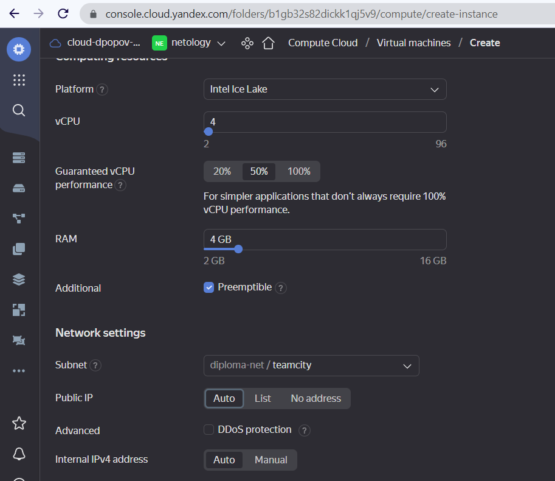

## Этап пятый (последный) - Установка и настройка системы CI/CD


В качестве системы CI/CD будем использовать [`TeamCity`](https://www.jetbrains.com/teamcity/) на отдельном от кластера Kubernetes инстансе в YandexCloud

1. Запускаем дополнительный инстанс в Yandex-cloud:
   
    * Добавляем инстансу 4 cpu, 4Gb RAM и 50Gb диск
    * Также не забываем добавить ключ ssh для подключения извне
    * Следует отметить, что данный хост следует создавать в отдельных от созданных на [первом этапе](diploma/terraform/README.md) при помощи _Terraform_ vpc и subnet YandexCloud     

  



2. Для запуска сервера и агентов [`Teamcity`](https://www.jetbrains.com/teamcity/) будем использовать готовый [`docker-compose`](https://github.com/rowhe/teamcity-docker-samples.git) манифест 
   
   * Подключаемся и устанавливаем [`docker`](https://www.docker.com/), [`docker-compose`](https://docs.docker.com/compose/)

```shell
$ ssh ubuntu@178.154.201.148
dpopov@dpopov-test:~/teamcity-docker-samples/compose-windows$ ssh ubuntu@178.154.201.148
Welcome to Ubuntu 20.04.6 LTS (GNU/Linux 5.4.0-146-generic x86_64)
...

ubuntu@teamcity:~$ sudo apt update & sudo apt install -y git docker docker-compose htop
```

<details>
   <summary>Install log</summary>

```shell
ubuntu@teamcity:~$ sudo apt update & sudo apt install -y git docker docker-compose htop
[1] 812
Reading package lists... Done
Hit:1 http://mirror.yandex.ru/ubuntu focal InRelease
Get:2 http://mirror.yandex.ru/ubuntu focal-updates InRelease [114 kB]
Get:3 http://mirror.yandex.ru/ubuntu focal-backports InRelease [108 kB]
Get:4 http://security.ubuntu.com/ubuntu focal-security InRelease [114 kB]
Building dependency tree       12%]
Reading state information... Done
Get:5 http://mirror.yandex.ru/ubuntu focal-updates/main i386 Packages [804 kB]
Get:6 http://mirror.yandex.ru/ubuntu focal-updates/main amd64 Packages [2,464 kB]
Get:7 http://mirror.yandex.ru/ubuntu focal-updates/main amd64 c-n-f Metadata [16.4 kB]
Get:8 http://mirror.yandex.ru/ubuntu focal-updates/universe amd64 Packages [1,046 kB]
Get:9 http://mirror.yandex.ru/ubuntu focal-updates/universe i386 Packages [721 kB]
Get:10 http://mirror.yandex.ru/ubuntu focal-updates/universe amd64 c-n-f Metadata [24.2 kB]
Get:11 http://mirror.yandex.ru/ubuntu focal-backports/main amd64 Packages [45.7 kB]
Get:12 http://mirror.yandex.ru/ubuntu focal-backports/main i386 Packages [36.1 kB]
Get:13 http://mirror.yandex.ru/ubuntu focal-backports/main amd64 c-n-f Metadata [1,420 B]
Get:14 http://mirror.yandex.ru/ubuntu focal-backports/universe amd64 Packages [24.9 kB]
Get:15 http://mirror.yandex.ru/ubuntu focal-backports/universe i386 Packages [13.8 kB]
Get:16 http://mirror.yandex.ru/ubuntu focal-backports/universe amd64 c-n-f Metadata [880 B]
0% [5 Packages store 0 B] [4 InRelease 25.8 kB/114 kB 23%]The following additional packages will be installed:
  bridge-utils containerd dns-root-data dnsmasq-base docker.io git-man libcurl3-gnutls liberror-perl libgdbm-compat4 libidn11 libperl5.30 patch perl perl-modules-5.30 pigz
  python3-cached-property python3-docker python3-dockerpty python3-docopt python3-texttable python3-websocket runc ubuntu-fan wmdocker
Suggested packages:
  ifupdown aufs-tools btrfs-progs cgroupfs-mount | cgroup-lite debootstrap docker-doc rinse zfs-fuse | zfsutils git-daemon-run | git-daemon-sysvinit git-doc git-el git-email git-gui
  gitk gitweb git-cvs git-mediawiki git-svn diffutils-doc perl-doc libterm-readline-gnu-perl | libterm-readline-perl-perl make libb-debug-perl liblocale-codes-perl
0% [6 Packages store 0 B] [4 InRelease 43.1 kB/114 kB 38%]The following NEW packages will be installed:
  bridge-utils containerd dns-root-data dnsmasq-base docker docker-compose docker.io git git-man htop libcurl3-gnutls liberror-perl libgdbm-compat4 libidn11 libperl5.30 patch perl
  perl-modules-5.30 pigz python3-cached-property python3-docker python3-dockerpty python3-docopt python3-texttable python3-websocket runc ubuntu-fan wmdocker
0 upgraded, 28 newly installed, 0 to remove and 0 not upgraded.
Need to get 79.1 MB of archives.
After this operation, 380 MB of additional disk space will be used.
Get:1 http://mirror.yandex.ru/ubuntu focal-updates/main amd64 perl-modules-5.30 all 5.30.0-9ubuntu0.3 [2,739 kB]
Get:2 http://mirror.yandex.ru/ubuntu focal/main amd64 libgdbm-compat4 amd64 1.18.1-5 [6,244 B]
Get:3 http://mirror.yandex.ru/ubuntu focal-updates/main amd64 libperl5.30 amd64 5.30.0-9ubuntu0.3 [3,951 kB]
Get:4 http://mirror.yandex.ru/ubuntu focal-updates/main amd64 perl amd64 5.30.0-9ubuntu0.3 [224 kB]
Get:5 http://mirror.yandex.ru/ubuntu focal/universe amd64 pigz amd64 2.4-1 [57.4 kB]
Get:6 http://mirror.yandex.ru/ubuntu focal/main amd64 bridge-utils amd64 1.6-2ubuntu1 [30.5 kB]
Get:7 http://mirror.yandex.ru/ubuntu focal-updates/main amd64 runc amd64 1.1.4-0ubuntu1~20.04.1 [3,817 kB]
Get:17 http://security.ubuntu.com/ubuntu focal-security/main i386 Packages [574 kB]
Get:8 http://mirror.yandex.ru/ubuntu focal-updates/main amd64 containerd amd64 1.6.12-0ubuntu1~20.04.1 [31.4 MB]
Get:18 http://security.ubuntu.com/ubuntu focal-security/main amd64 Packages [2,082 kB]
Get:19 http://security.ubuntu.com/ubuntu focal-security/main Translation-en [338 kB]
Get:20 http://security.ubuntu.com/ubuntu focal-security/main amd64 c-n-f Metadata [12.5 kB]
Get:21 http://security.ubuntu.com/ubuntu focal-security/universe i386 Packages [590 kB]
Get:22 http://security.ubuntu.com/ubuntu focal-security/universe amd64 Packages [820 kB]
Get:23 http://security.ubuntu.com/ubuntu focal-security/universe amd64 c-n-f Metadata [17.6 kB]
Fetched 9,970 kB in 2s (4,523 kB/s)7%]
Get:9 http://mirror.yandex.ru/ubuntu focal/main amd64 dns-root-data all 2019052802 [5,300 B]
Get:10 http://mirror.yandex.ru/ubuntu focal/main amd64 libidn11 amd64 1.33-2.2ubuntu2 [46.2 kB]
Get:11 http://mirror.yandex.ru/ubuntu focal-updates/main amd64 dnsmasq-base amd64 2.80-1.1ubuntu1.6 [315 kB]
Get:12 http://mirror.yandex.ru/ubuntu focal/universe amd64 wmdocker amd64 1.5-2 [13.0 kB]
Get:13 http://mirror.yandex.ru/ubuntu focal/universe amd64 docker all 1.5-2 [1,316 B]
Get:14 http://mirror.yandex.ru/ubuntu focal/universe amd64 python3-cached-property all 1.5.1-4 [10.9 kB]
Get:15 http://mirror.yandex.ru/ubuntu focal/universe amd64 python3-websocket all 0.53.0-2ubuntu1 [32.3 kB]
Get:16 http://mirror.yandex.ru/ubuntu focal/universe amd64 python3-docker all 4.1.0-1 [83.8 kB]
Get:17 http://mirror.yandex.ru/ubuntu focal/universe amd64 python3-dockerpty all 0.4.1-2 [11.1 kB]
Get:18 http://mirror.yandex.ru/ubuntu focal/universe amd64 python3-docopt all 0.6.2-2.2ubuntu1 [19.7 kB]
Get:19 http://mirror.yandex.ru/ubuntu focal/universe amd64 python3-texttable all 1.6.2-2 [11.0 kB]
Get:20 http://mirror.yandex.ru/ubuntu focal/universe amd64 docker-compose all 1.25.0-1 [92.7 kB]
Get:21 http://mirror.yandex.ru/ubuntu focal-updates/universe amd64 docker.io amd64 20.10.21-0ubuntu1~20.04.1 [30.3 MB]
Reading package lists... Done3 MB 41%]                                                                                                                                     7,774 kB/s 3s
Building dependency tree       MB 55%]                                                                                                                                     7,774 kB/s 2s
Reading state information... Done
5 packages can be upgraded. Run 'apt list --upgradable' to see them.
Get:22 http://mirror.yandex.ru/ubuntu focal-updates/main amd64 libcurl3-gnutls amd64 7.68.0-1ubuntu2.18 [233 kB]
Get:23 http://mirror.yandex.ru/ubuntu focal/main amd64 liberror-perl all 0.17029-1 [26.5 kB]
Get:24 http://mirror.yandex.ru/ubuntu focal-updates/main amd64 git-man all 1:2.25.1-1ubuntu3.10 [887 kB]
Get:25 http://mirror.yandex.ru/ubuntu focal-updates/main amd64 git amd64 1:2.25.1-1ubuntu3.10 [4,534 kB]
Get:26 http://mirror.yandex.ru/ubuntu focal/main amd64 htop amd64 2.2.0-2build1 [80.5 kB]
Get:27 http://mirror.yandex.ru/ubuntu focal/main amd64 patch amd64 2.7.6-6 [105 kB]
Get:28 http://mirror.yandex.ru/ubuntu focal-updates/main amd64 ubuntu-fan all 0.12.13ubuntu0.1 [34.4 kB]
Fetched 79.1 MB in 11s (7,360 kB/s)
Preconfiguring packages ...
Selecting previously unselected package perl-modules-5.30.
(Reading database ... 102566 files and directories currently installed.)
Preparing to unpack .../00-perl-modules-5.30_5.30.0-9ubuntu0.3_all.deb ...
Unpacking perl-modules-5.30 (5.30.0-9ubuntu0.3) ...
Selecting previously unselected package libgdbm-compat4:amd64.
Preparing to unpack .../01-libgdbm-compat4_1.18.1-5_amd64.deb ...
Unpacking libgdbm-compat4:amd64 (1.18.1-5) ...
Selecting previously unselected package libperl5.30:amd64.
Preparing to unpack .../02-libperl5.30_5.30.0-9ubuntu0.3_amd64.deb ...
Unpacking libperl5.30:amd64 (5.30.0-9ubuntu0.3) ...
Selecting previously unselected package perl.
Preparing to unpack .../03-perl_5.30.0-9ubuntu0.3_amd64.deb ...
Unpacking perl (5.30.0-9ubuntu0.3) ...
Selecting previously unselected package pigz.
Preparing to unpack .../04-pigz_2.4-1_amd64.deb ...
Unpacking pigz (2.4-1) ...
Selecting previously unselected package bridge-utils.
Preparing to unpack .../05-bridge-utils_1.6-2ubuntu1_amd64.deb ...
Unpacking bridge-utils (1.6-2ubuntu1) ...
Selecting previously unselected package runc.
Preparing to unpack .../06-runc_1.1.4-0ubuntu1~20.04.1_amd64.deb ...
Unpacking runc (1.1.4-0ubuntu1~20.04.1) ...
Selecting previously unselected package containerd.
Preparing to unpack .../07-containerd_1.6.12-0ubuntu1~20.04.1_amd64.deb ...
Unpacking containerd (1.6.12-0ubuntu1~20.04.1) ...
Selecting previously unselected package dns-root-data.
Preparing to unpack .../08-dns-root-data_2019052802_all.deb ...
Unpacking dns-root-data (2019052802) ...
Selecting previously unselected package libidn11:amd64.
Preparing to unpack .../09-libidn11_1.33-2.2ubuntu2_amd64.deb ...
Unpacking libidn11:amd64 (1.33-2.2ubuntu2) ...
Selecting previously unselected package dnsmasq-base.
Preparing to unpack .../10-dnsmasq-base_2.80-1.1ubuntu1.6_amd64.deb ...
Unpacking dnsmasq-base (2.80-1.1ubuntu1.6) ...
Selecting previously unselected package wmdocker.
Preparing to unpack .../11-wmdocker_1.5-2_amd64.deb ...
Unpacking wmdocker (1.5-2) ...
Selecting previously unselected package docker.
Preparing to unpack .../12-docker_1.5-2_all.deb ...
Unpacking docker (1.5-2) ...
Selecting previously unselected package python3-cached-property.
Preparing to unpack .../13-python3-cached-property_1.5.1-4_all.deb ...
Unpacking python3-cached-property (1.5.1-4) ...
Selecting previously unselected package python3-websocket.
Preparing to unpack .../14-python3-websocket_0.53.0-2ubuntu1_all.deb ...
Unpacking python3-websocket (0.53.0-2ubuntu1) ...
Selecting previously unselected package python3-docker.
Preparing to unpack .../15-python3-docker_4.1.0-1_all.deb ...
Unpacking python3-docker (4.1.0-1) ...
Selecting previously unselected package python3-dockerpty.
Preparing to unpack .../16-python3-dockerpty_0.4.1-2_all.deb ...
Unpacking python3-dockerpty (0.4.1-2) ...
Selecting previously unselected package python3-docopt.
Preparing to unpack .../17-python3-docopt_0.6.2-2.2ubuntu1_all.deb ...
Unpacking python3-docopt (0.6.2-2.2ubuntu1) ...
Selecting previously unselected package python3-texttable.
Preparing to unpack .../18-python3-texttable_1.6.2-2_all.deb ...
Unpacking python3-texttable (1.6.2-2) ...
Selecting previously unselected package docker-compose.
Preparing to unpack .../19-docker-compose_1.25.0-1_all.deb ...
Unpacking docker-compose (1.25.0-1) ...
Selecting previously unselected package docker.io.
Preparing to unpack .../20-docker.io_20.10.21-0ubuntu1~20.04.1_amd64.deb ...
Unpacking docker.io (20.10.21-0ubuntu1~20.04.1) ...
Selecting previously unselected package libcurl3-gnutls:amd64.
Preparing to unpack .../21-libcurl3-gnutls_7.68.0-1ubuntu2.18_amd64.deb ...
Unpacking libcurl3-gnutls:amd64 (7.68.0-1ubuntu2.18) ...
Selecting previously unselected package liberror-perl.
Preparing to unpack .../22-liberror-perl_0.17029-1_all.deb ...
Unpacking liberror-perl (0.17029-1) ...
Selecting previously unselected package git-man.
Preparing to unpack .../23-git-man_1%3a2.25.1-1ubuntu3.10_all.deb ...
Unpacking git-man (1:2.25.1-1ubuntu3.10) ...
Selecting previously unselected package git.
Preparing to unpack .../24-git_1%3a2.25.1-1ubuntu3.10_amd64.deb ...
Unpacking git (1:2.25.1-1ubuntu3.10) ...
Selecting previously unselected package htop.
Preparing to unpack .../25-htop_2.2.0-2build1_amd64.deb ...
Unpacking htop (2.2.0-2build1) ...
Selecting previously unselected package patch.
Preparing to unpack .../26-patch_2.7.6-6_amd64.deb ...
Unpacking patch (2.7.6-6) ...
Selecting previously unselected package ubuntu-fan.
Preparing to unpack .../27-ubuntu-fan_0.12.13ubuntu0.1_all.deb ...
Unpacking ubuntu-fan (0.12.13ubuntu0.1) ...
Setting up python3-cached-property (1.5.1-4) ...
Setting up python3-texttable (1.6.2-2) ...
Setting up python3-docopt (0.6.2-2.2ubuntu1) ...
Setting up perl-modules-5.30 (5.30.0-9ubuntu0.3) ...
Setting up htop (2.2.0-2build1) ...
Setting up wmdocker (1.5-2) ...
Setting up libcurl3-gnutls:amd64 (7.68.0-1ubuntu2.18) ...
Setting up runc (1.1.4-0ubuntu1~20.04.1) ...
Setting up dns-root-data (2019052802) ...
Setting up libidn11:amd64 (1.33-2.2ubuntu2) ...
Setting up patch (2.7.6-6) ...
Setting up libgdbm-compat4:amd64 (1.18.1-5) ...
Setting up bridge-utils (1.6-2ubuntu1) ...
Setting up pigz (2.4-1) ...
Setting up libperl5.30:amd64 (5.30.0-9ubuntu0.3) ...
Setting up git-man (1:2.25.1-1ubuntu3.10) ...
Setting up containerd (1.6.12-0ubuntu1~20.04.1) ...
Created symlink /etc/systemd/system/multi-user.target.wants/containerd.service → /lib/systemd/system/containerd.service.
Setting up python3-websocket (0.53.0-2ubuntu1) ...
update-alternatives: using /usr/bin/python3-wsdump to provide /usr/bin/wsdump (wsdump) in auto mode
Setting up python3-dockerpty (0.4.1-2) ...
Setting up docker (1.5-2) ...
Setting up python3-docker (4.1.0-1) ...
Setting up docker.io (20.10.21-0ubuntu1~20.04.1) ...
Adding group `docker' (GID 115) ...
Done.
Created symlink /etc/systemd/system/multi-user.target.wants/docker.service → /lib/systemd/system/docker.service.
Created symlink /etc/systemd/system/sockets.target.wants/docker.socket → /lib/systemd/system/docker.socket.
Setting up dnsmasq-base (2.80-1.1ubuntu1.6) ...
Setting up perl (5.30.0-9ubuntu0.3) ...
Setting up ubuntu-fan (0.12.13ubuntu0.1) ...
Created symlink /etc/systemd/system/multi-user.target.wants/ubuntu-fan.service → /lib/systemd/system/ubuntu-fan.service.
Setting up docker-compose (1.25.0-1) ...
Setting up liberror-perl (0.17029-1) ...
Setting up git (1:2.25.1-1ubuntu3.10) ...
Processing triggers for libc-bin (2.31-0ubuntu9.9) ...
Processing triggers for systemd (245.4-4ubuntu3.20) ...
Processing triggers for man-db (2.9.1-1) ...
Processing triggers for dbus (1.12.16-2ubuntu2.3) ...
Processing triggers for mime-support (3.64ubuntu1) ...

```
</details>


3. Клонируем репозиторий с [манифестами](https://github.com/rowhe/teamcity-docker-samples.git)  

```shell
ubuntu@teamcity:~$ git clone https://github.com/rowhe/teamcity-docker-samples.git
Cloning into 'teamcity-docker-samples'...
remote: Enumerating objects: 91, done.
remote: Counting objects: 100% (13/13), done.
remote: Compressing objects: 100% (7/7), done.
remote: Total 91 (delta 6), reused 6 (delta 6), pack-reused 78
Unpacking objects: 100% (91/91), 17.35 KiB | 1.08 MiB/s, done.
ubuntu@teamcity:~$
```

4. Добавляем своего пользователя в группу `docker` для возможности запуска контейнеров без команды sudo и перелогиниваемся

```shell
ubuntu@teamcity:~$ sudo usermod -aG docker ubuntu
ubuntu@teamcity:~$ ^D
```

4.1 Для работы `kubectl` c нашим кластером добавим в `docker-compose.yml` подключение раздела с `~/.kube/config` и `~/.ssh/`

```shell
volumes:
      - ~/.kube:/home/buildagent/.kube
      - ~/.ssh:/home/buildagent/.ssh
```

4.2 Также на агенты будет необходимо установить и сконфигурировать утилиту `yc` для получения актуальных айпи инстансов _YandexCloud_ 

```shell
curl -sSL https://storage.yandexcloud.net/yandexcloud-yc/install.sh | bash
```

5. Запускаем контейнеры предварительно изменив пользователя и пароль к ДБ в манифесте `docker-compose.yaml`

```shell
ubuntu@teamcity:~$ cd teamcity-docker-samples/compose-ubuntu/
ubuntu@teamcity:~/teamcity-docker-samples/compose-ubuntu$ docker-compose up -d
Creating network "compose-ubuntu_default" with the default driver
Pulling db (postgres:latest)...
...
Status: Downloaded newer image for postgres:latest
Pulling teamcity (jetbrains/teamcity-server:2021.1)...
...
Status: Downloaded newer image for jetbrains/teamcity-server:2021.1
Pulling teamcity-agent-1 (jetbrains/teamcity-agent:2021.1-linux-sudo)...
...
Status: Downloaded newer image for jetbrains/teamcity-agent:2021.1-linux-sudo
Creating compose-ubuntu_db_1               ... done
Creating compose-ubuntu_teamcity-agent-1_1 ... done
Creating compose-ubuntu_teamcity-agent-2_1 ... done
Creating compose-ubuntu_teamcity_1         ... done
ubuntu@teamcity:~/teamcity-docker-samples/compose-ubuntu$
```

6. Получаем токен администратора `Teamcity` и логинимся

```shell
ubuntu@teamcity:~/teamcity-docker-samples/compose-ubuntu$ docker logs 2907af79b458 |grep token
[TeamCity] Super user authentication token: 39616*********44220 (use empty username with the token as the password to access the server)
ubuntu@teamcity:~/teamcity-docker-samples/compose-ubuntu$
```

7. Создаем пользователя для управления конфигурацией `Teamcity` и перелогиниваемся под ним


8. После этого необходимо авторизовать агентов


9. Создаем проект


10. Добавим _connection_ для подключения к регистри docker.io


10. Установим [`git`](https://git-scm.com/), [`helm`](https://helm.sh/) [`kubectl`](https://kubernetes.io/docs/tasks/tools/) и перенесем конфиг `.kube/config` из кластера на агенты

```shell
$ sudo docker exec -it c5c882b3cf59 sudo curl -LO https://storage.googleapis.com/kubernetes-release/release/`curl -s https://storage.googleapis.com/kubernetes-release/release/stable.txt`/bin/linux/amd64/kubectl
  % Total    % Received % Xferd  Average Speed   Time    Time     Time  Current
                                 Dload  Upload   Total   Spent    Left  Speed
100 45.8M  100 45.8M    0     0  21.6M      0  0:00:02  0:00:02 --:--:-- 21.6M
$ sudo docker exec -it c5c882b3cf59 sudo chmod +x kubectl
$ sudo docker exec -it c5c882b3cf59 sudo mv kubectl /usr/local/bin/

$ sudo docker exec -it c5c882b3cf59 sudo apt install git
Reading package lists... Done
Building dependency tree
Reading state information... Done
...
Setting up git (1:2.25.1-1ubuntu3.10) ...

$ curl -fsSL -o get_helm.sh https://raw.githubusercontent.com/helm/helm/main/scripts/get-helm-3
$ chmod 700 get_helm.sh
$ ./get_helm.sh
Downloading https://get.helm.sh/helm-v3.11.2-linux-amd64.tar.gz
Verifying checksum... Done.
Preparing to install helm into /usr/local/bin
helm installed into /usr/local/bin/helm
```

11. Для разного функционала билдов нам потребуется два варианта настройки VCS


В конфигурации для сборки нового имиджа и пуша в регистри будем использовать стандартную конфигурацию VSC


В второй конфигурации для сборки, пуша по тэгам будем использовать другую конфигурацию. <br>
В ней необходимо указать спецификацию бранча и включить функцию "Use tags as branches" 


Также создаем в проекте две билд конфигурации с разными шагами сборки


В билд конфигурации _Docker build + push_ добавляем триггер, который позволит ограничить срабатывание триггера и запуск билд-процесса директорией где находится конфигурация нашего вэб-приложения


Укажем используемый _VSC root_


Также подключим ранее созданный функционал _Docker_


11. Теперь настроим шаги сборки этой билд-конфигурации

Первым шагом соберем новый имидж


Вторым шагом отправляем его в регистри DockerHub


Теперь проверим работу билд-конфигурации сделав коммит и пуш в репозиторий таким образом запустив сборку по триггеру

<details>
<summary>Build log</summary>

```yaml
Build 'Diploma ci-cd / Docker build + push' #63, default branch 'refs/heads/main'
Triggered 2023-04-25 17:40:37 by 'Git'
Started 2023-04-25 17:40:37 on agent 'Agent 1-2'
Finished 2023-04-25 17:40:59 with status NORMAL 'Success'
VCS revisions: 'DiplomaCiCd_HttpsGithubComRowheDevopsDiplomYandexcloudGit' (Git, instance id 4): 'fa560797caa2c3000bcf34cbe8f471f36cf8623d' (branch: 'refs/heads/main')
TeamCity URL http://178.154.201.148:8112/viewLog.html?buildId=1326&buildTypeId=DiplomaCiCd_DockerBuild 
TeamCity server version is 2021.1 (build 92597), server timezone: GMT (UTC)

[17:40:37] : bt2 (22s)
[17:40:37]i: TeamCity server version is 2021.1 (build 92597)
[17:40:37] : The build is removed from the queue to be prepared for the start
[17:40:37] : Collecting changes in 1 VCS root
[17:40:37] :	 [Collecting changes in 1 VCS root] VCS Root details
[17:40:37] :		 [VCS Root details] "https://github.com/rowhe/devops-diplom-yandexcloud.git" {instance id=4, parent internal id=2, parent id=DiplomaCiCd_HttpsGithubComRowheDevopsDiplomYandexcloudGit, description: "https://github.com/rowhe/devops-diplom-yandexcloud.git#refs/heads/main"}
[17:40:37]i:	 [Collecting changes in 1 VCS root] Detecting changes in VCS root 'https://github.com/rowhe/devops-diplom-yandexcloud.git' (used in 'Docker build + push')
[17:40:37]i:	 [Collecting changes in 1 VCS root] Will collect changes for 'https://github.com/rowhe/devops-diplom-yandexcloud.git' starting from revision fa560797caa2c3000bcf34cbe8f471f36cf8623d
[17:40:37] :	 [Collecting changes in 1 VCS root] Compute revision for 'https://github.com/rowhe/devops-diplom-yandexcloud.git'
[17:40:37] :		 [Compute revision for 'https://github.com/rowhe/devops-diplom-yandexcloud.git'] Upper limit revision: fa560797caa2c3000bcf34cbe8f471f36cf8623d
[17:40:37]i:		 [Compute revision for 'https://github.com/rowhe/devops-diplom-yandexcloud.git'] MaxModId = 130
[17:40:37] :		 [Compute revision for 'https://github.com/rowhe/devops-diplom-yandexcloud.git'] The first revision that was detected in the branch refs/heads/main: 426ec9576f7aeff6efcb8e36c8f38f52e7e60221
[17:40:37] :		 [Compute revision for 'https://github.com/rowhe/devops-diplom-yandexcloud.git'] Latest commit attached to build configuration (with id <= 130): fa560797caa2c3000bcf34cbe8f471f36cf8623d
[17:40:37] :		 [Compute revision for 'https://github.com/rowhe/devops-diplom-yandexcloud.git'] Computed revision: fa560797caa2c3000bcf34cbe8f471f36cf8623d
[17:40:37] : Starting the build on the agent "Agent 1-2"
[17:40:37]i: Agent time zone: Europe/London
[17:40:37]i: Agent is running under JRE: 1.8.0_292-b10
[17:40:37] : Updating tools for build
[17:40:37] :	 [Updating tools for build] Tools are not required for the build
[17:40:37]i: Docker monitor started with command: /bin/sh -c "sudo -E docker events --format "{{json .}}""
[17:40:45]i: Running docker login: `sudo -E docker login -u "rowhe" --password-stdin 
[17:40:45] : Clearing temporary directory: /opt/buildagent/temp/buildTmp
[17:40:45] : Publishing internal artifacts (3s)
[17:40:49] :	 [Publishing internal artifacts] Publishing 1 file using [WebPublisher]
[17:40:49] :	 [Publishing internal artifacts] Publishing 1 file using [ArtifactsCachePublisher]
[17:40:45] : Using vcs information from agent file: 69f3d40cd90d0ae7.xml
[17:40:45] : Checkout directory: /opt/buildagent/work/69f3d40cd90d0ae7
[17:40:45] : Updating sources: auto checkout (on agent) (1s)
[17:40:45] :	 [Updating sources] Will use agent side checkout
[17:40:45] :	 [Updating sources] VCS Root: https://github.com/rowhe/devops-diplom-yandexcloud.git (1s)
[17:40:45] :		 [VCS Root: https://github.com/rowhe/devops-diplom-yandexcloud.git] revision: fa560797caa2c3000bcf34cbe8f471f36cf8623d
[17:40:45]i:		 [VCS Root: https://github.com/rowhe/devops-diplom-yandexcloud.git] Mirrors automatically enabled
[17:40:45] :		 [VCS Root: https://github.com/rowhe/devops-diplom-yandexcloud.git] Git version: 2.25.1.0
[17:40:45] :		 [VCS Root: https://github.com/rowhe/devops-diplom-yandexcloud.git] Update git mirror (/opt/buildagent/system/git/git-42C98668.git)
[17:40:45] :			 [Update git mirror (/opt/buildagent/system/git/git-42C98668.git)] /usr/bin/git config http.sslCAInfo
[17:40:45] :			 [Update git mirror (/opt/buildagent/system/git/git-42C98668.git)] /usr/bin/git show-ref
[17:40:45] :			 [Update git mirror (/opt/buildagent/system/git/git-42C98668.git)] /usr/bin/git -c credential.helper= ls-remote origin
[17:40:45] :			 [Update git mirror (/opt/buildagent/system/git/git-42C98668.git)] /usr/bin/git show-ref refs/remotes/origin/main
[17:40:45] :			 [Update git mirror (/opt/buildagent/system/git/git-42C98668.git)] /usr/bin/git show-ref refs/heads/main
[17:40:45] :			 [Update git mirror (/opt/buildagent/system/git/git-42C98668.git)] /usr/bin/git -c credential.helper= fetch --progress --recurse-submodules=no origin +refs/heads/main:refs/heads/main
[17:40:46]i:				 [/usr/bin/git -c credential.helper= fetch --progress --recurse-submodules=no origin +refs/heads/main:refs/heads/main] remote: Enumerating objects: 1, done.        
[17:40:46]i:				 [/usr/bin/git -c credential.helper= fetch --progress --recurse-submodules=no origin +refs/heads/main:refs/heads/main] remote: Counting objects: 100% (1/1)        
[17:40:46]i:				 [/usr/bin/git -c credential.helper= fetch --progress --recurse-submodules=no origin +refs/heads/main:refs/heads/main] remote: Counting objects: 100% (1/1), done.        
[17:40:46]i:				 [/usr/bin/git -c credential.helper= fetch --progress --recurse-submodules=no origin +refs/heads/main:refs/heads/main] remote: Total 1 (delta 0), reused 1 (delta 0), pack-reused 0        
[17:40:46]i:				 [/usr/bin/git -c credential.helper= fetch --progress --recurse-submodules=no origin +refs/heads/main:refs/heads/main] From https://github.com/rowhe/devops-diplom-yandexcloud
[17:40:46]i:				 [/usr/bin/git -c credential.helper= fetch --progress --recurse-submodules=no origin +refs/heads/main:refs/heads/main]    5b4c184..fa56079  main       -> main
[17:40:46]i:				 [/usr/bin/git -c credential.helper= fetch --progress --recurse-submodules=no origin +refs/heads/main:refs/heads/main]  * [new tag]         0.0.55     -> 0.0.55
[17:40:46]i:				 [/usr/bin/git -c credential.helper= fetch --progress --recurse-submodules=no origin +refs/heads/main:refs/heads/main]    5b4c184..fa56079  main       -> origin/main
[17:40:46] :			 [Update git mirror (/opt/buildagent/system/git/git-42C98668.git)] /usr/bin/git log -n1 --pretty=format:%H%x20%s fa560797caa2c3000bcf34cbe8f471f36cf8623d --
[17:40:46] :			 [Update git mirror (/opt/buildagent/system/git/git-42C98668.git)] /usr/bin/git pack-refs --all
[17:40:46] :		 [VCS Root: https://github.com/rowhe/devops-diplom-yandexcloud.git] Update checkout directory (/opt/buildagent/work/69f3d40cd90d0ae7)
[17:40:46] :			 [Update checkout directory (/opt/buildagent/work/69f3d40cd90d0ae7)] /usr/bin/git rev-parse --is-shallow-repository
[17:40:46] :			 [Update checkout directory (/opt/buildagent/work/69f3d40cd90d0ae7)] /usr/bin/git config lfs.storage /opt/buildagent/system/git/git-42C98668.git/lfs
[17:40:46] :			 [Update checkout directory (/opt/buildagent/work/69f3d40cd90d0ae7)] /usr/bin/git config core.sparseCheckout true
[17:40:46] :			 [Update checkout directory (/opt/buildagent/work/69f3d40cd90d0ae7)] /usr/bin/git config http.sslCAInfo
[17:40:46] :			 [Update checkout directory (/opt/buildagent/work/69f3d40cd90d0ae7)] /usr/bin/git show-ref
[17:40:46] :			 [Update checkout directory (/opt/buildagent/work/69f3d40cd90d0ae7)] /usr/bin/git show-ref refs/remotes/origin/main
[17:40:46] :			 [Update checkout directory (/opt/buildagent/work/69f3d40cd90d0ae7)] /usr/bin/git log -n1 --pretty=format:%H%x20%s fa560797caa2c3000bcf34cbe8f471f36cf8623d --
[17:40:46] :			 [Update checkout directory (/opt/buildagent/work/69f3d40cd90d0ae7)] /usr/bin/git branch
[17:40:46] :			 [Update checkout directory (/opt/buildagent/work/69f3d40cd90d0ae7)] /usr/bin/git -c credential.helper= reset --hard fa560797caa2c3000bcf34cbe8f471f36cf8623d
[17:40:46] :			 [Update checkout directory (/opt/buildagent/work/69f3d40cd90d0ae7)] /usr/bin/git branch --set-upstream-to=refs/remotes/origin/main
[17:40:46] : Build preparation done
[17:40:46] : Step 1/2: Docker (2s)
[17:40:46] :	 [Step 1/2] Starting: sudo -E docker build -t rowhe/nginx_static_index --pull -f Dockerfile .
[17:40:46] :	 [Step 1/2] in directory: /opt/buildagent/work/69f3d40cd90d0ae7/diploma/app/docker
[17:40:46] :	 [Step 1/2] Sending build context to Docker daemon  4.096kB
[17:40:46] :	 [Step 1/2] 
[17:40:46] :	 [Step 1/2] Step 1/4 : FROM nginx:alpine
[17:40:48] :	 [Step 1/2] alpine: Pulling from library/nginx
[17:40:48] :	 [Step 1/2] Digest: sha256:dd2a9179765849767b10e2adde7e10c4ad6b7e4d4846e6b77ec93f080cd2db27
[17:40:48] :	 [Step 1/2] Status: Image is up to date for nginx:alpine
[17:40:48] :	 [Step 1/2]  ---> 8e75cbc5b25c
[17:40:48] :	 [Step 1/2] Step 2/4 : COPY default.conf /etc/nginx/conf.d/
[17:40:48]i:	 [Step 1/2] Docker event: {"status":"pull","id":"nginx:alpine","Type":"image","Action":"pull","Actor":{"ID":"nginx:alpine","Attributes":{"maintainer":"NGINX Docker Maintainers <docker-maint@nginx.com>","name":"nginx"}},"scope":"local","time":1682444448,"timeNano":1682444448584940729}
[17:40:48] :	 [Step 1/2]  ---> 3bee55624c95
[17:40:48] :	 [Step 1/2] Step 3/4 : COPY index.html /usr/share/nginx/html/
[17:40:49] :	 [Step 1/2]  ---> a9fe06a02de0
[17:40:49] :	 [Step 1/2] Step 4/4 : CMD ["nginx", "-g", "daemon off;"]
[17:40:49] :	 [Step 1/2]  ---> Running in 4ba98db212b9
[17:40:49]i:	 [Step 1/2] Docker event: {"status":"create","id":"4ba98db212b9107a28f405c71a4bc7afab8fa482ed45f3df42797521c652d3d3","from":"sha256:a9fe06a02de0452d0141962696ea1fd7ea7520f2cbaa501a1b5092afed5f6588","Type":"container","Action":"create","Actor":{"ID":"4ba98db212b9107a28f405c71a4bc7afab8fa482ed45f3df42797521c652d3d3","Attributes":{"image":"sha256:a9fe06a02de0452d0141962696ea1fd7ea7520f2cbaa501a1b5092afed5f6588","maintainer":"NGINX Docker Maintainers <docker-maint@nginx.com>","name":"distracted_dewdney"}},"scope":"local","time":1682444449,"timeNano":1682444449165634103}
[17:40:49] :	 [Step 1/2] Removing intermediate container 4ba98db212b9
[17:40:49] :	 [Step 1/2]  ---> b75294e53887
[17:40:49]i:	 [Step 1/2] ##teamcity[dockerMessage type='dockerImage.build' value='b75294e53887']
[17:40:49] :	 [Step 1/2] Successfully built b75294e53887
[17:40:49]i:	 [Step 1/2] Docker event: {"status":"destroy","id":"4ba98db212b9107a28f405c71a4bc7afab8fa482ed45f3df42797521c652d3d3","from":"sha256:a9fe06a02de0452d0141962696ea1fd7ea7520f2cbaa501a1b5092afed5f6588","Type":"container","Action":"destroy","Actor":{"ID":"4ba98db212b9107a28f405c71a4bc7afab8fa482ed45f3df42797521c652d3d3","Attributes":{"image":"sha256:a9fe06a02de0452d0141962696ea1fd7ea7520f2cbaa501a1b5092afed5f6588","maintainer":"NGINX Docker Maintainers <docker-maint@nginx.com>","name":"distracted_dewdney"}},"scope":"local","time":1682444449,"timeNano":1682444449302452262}
[17:40:49] :	 [Step 1/2] Successfully tagged rowhe/nginx_static_index:latest
[17:40:49] :	 [Step 1/2] Process exited with code 0
[17:40:49] : Step 2/2: Push docker image to DockerHub (Docker) (8s)
[17:40:49] :	 [Step 2/2] Starting: /bin/sh -c "sudo -E docker push  rowhe/nginx_static_index"
[17:40:49] :	 [Step 2/2] in directory: /opt/buildagent/work/69f3d40cd90d0ae7
[17:40:49] :	 [Step 2/2] The push refers to repository [docker.io/rowhe/nginx_static_index]
[17:40:49] :	 [Step 2/2] 84091cb482cb: Preparing
[17:40:49] :	 [Step 2/2] 7b044eec0425: Preparing
[17:40:49] :	 [Step 2/2] 31531248c7cb: Preparing
[17:40:49] :	 [Step 2/2] f9cb3f1f1d3d: Preparing
[17:40:49] :	 [Step 2/2] f0fb842dea41: Preparing
[17:40:49] :	 [Step 2/2] c1cd5c8c68ef: Preparing
[17:40:49] :	 [Step 2/2] 1d54586a1706: Preparing
[17:40:49] :	 [Step 2/2] 1003ff723696: Preparing
[17:40:49] :	 [Step 2/2] f1417ff83b31: Preparing
[17:40:49] :	 [Step 2/2] c1cd5c8c68ef: Waiting
[17:40:49] :	 [Step 2/2] 1d54586a1706: Waiting
[17:40:49] :	 [Step 2/2] 1003ff723696: Waiting
[17:40:49] :	 [Step 2/2] f1417ff83b31: Waiting
[17:40:50] :	 [Step 2/2] 31531248c7cb: Layer already exists
[17:40:50] :	 [Step 2/2] f9cb3f1f1d3d: Layer already exists
[17:40:50] :	 [Step 2/2] f0fb842dea41: Layer already exists
[17:40:51] :	 [Step 2/2] 1003ff723696: Layer already exists
[17:40:51] :	 [Step 2/2] c1cd5c8c68ef: Layer already exists
[17:40:51] :	 [Step 2/2] 1d54586a1706: Layer already exists
[17:40:51] :	 [Step 2/2] f1417ff83b31: Layer already exists
[17:40:53] :	 [Step 2/2] 84091cb482cb: Pushed
[17:40:53] :	 [Step 2/2] 7b044eec0425: Pushed
[17:40:57]i:	 [Step 2/2] ##teamcity[dockerMessage type='dockerImage.push' value='docker.io/rowhe/nginx_static_index:latest,size:2195,digest:sha256:e317adfa32fceca00c6dc5d49c5c0cf89ccb10fd7a1d704dca81142fce06d73f']
[17:40:57] :	 [Step 2/2] latest: digest: sha256:e317adfa32fceca00c6dc5d49c5c0cf89ccb10fd7a1d704dca81142fce06d73f size: 2195
[17:40:57]i:	 [Step 2/2] Docker event: {"status":"push","id":"rowhe/nginx_static_index","Type":"image","Action":"push","Actor":{"ID":"rowhe/nginx_static_index","Attributes":{"maintainer":"NGINX Docker Maintainers <docker-maint@nginx.com>","name":"rowhe/nginx_static_index"}},"scope":"local","time":1682444457,"timeNano":1682444457640940207}
[17:40:57] :	 [Step 2/2] Process exited with code 0
[17:40:57] :	 [Step 2/2] Removing pushed images/tags from build agent: rowhe/nginx_static_index
[17:40:58]i: Running docker logout: sudo -E docker logout 
[17:40:58] : Publishing internal artifacts (1s)
[17:40:59] :	 [Publishing internal artifacts] Publishing 1 file using [WebPublisher]
[17:40:59] :	 [Publishing internal artifacts] Publishing 1 file using [ArtifactsCachePublisher]
[17:40:59] : Build finished
```
</details>

Убеждаемся, что образ успешно появляется в регистри _DockerHub_


### Вывод - билд-конфигурация _Docker build + push_ успешно работает


12. Теперь настроим шаги сборки по тэгам

Для билд конфигурации _Docker build + push + helm upgrade_ используем другой триггер


Теперь добавим необходимые для работы билд-конфигурации параметры


Также как и в предыдущей билд-конфигурации добавим билд-фичу для работы с регистри _Docker_


В данной конфигурации нам потребуются 5 шагов сборки


Для старта сборки создадим коммит с тэгом 0.0.61 и запушим его в репозиторий


Билд по тэгу проходит успешно:


<details>
<summary>Build log</summary>

```yaml
Build 'Diploma ci-cd / Docker build + push + helm upgrade' #109, branch '0.0.61'
Triggered 2023-04-26 14:36:16 by 'Git'
Started 2023-04-26 14:36:21 on agent 'Agent 2-1'
Finished 2023-04-26 14:36:47 with status NORMAL 'Success'
VCS revisions: 'DiplomaCiCd_HttpsGithubComRowheDevopsDiplomYandexcloudGitTags' (Git, instance id 16): 'a1f1b189c04f1fc5db35043a79e1cf0b1cac2666' (branch: 'refs/tags/0.0.61')
TeamCity URL http://178.154.201.148:8112/viewLog.html?buildId=1416&buildTypeId=DiplomaCiCd_AppPipeline 
TeamCity server version is 2021.1 (build 92597), server timezone: GMT (UTC)

[14:36:16]W: bt4 (31s)
[14:36:16]i: TeamCity server version is 2021.1 (build 92597)
[14:36:16] : The build is removed from the queue to be prepared for the start
[14:36:16] : Collecting changes in 1 VCS root
[14:36:16] :	 [Collecting changes in 1 VCS root] VCS Root details
[14:36:16] :		 [VCS Root details] "https://github.com/rowhe/devops-diplom-yandexcloud.git TAGS" {instance id=16, parent internal id=3, parent id=DiplomaCiCd_HttpsGithubComRowheDevopsDiplomYandexcloudGitTags, description: "https://github.com/rowhe/devops-diplom-yandexcloud.git#refs/heads/main"}
[14:36:17]i:	 [Collecting changes in 1 VCS root] Detecting changes in VCS root 'https://github.com/rowhe/devops-diplom-yandexcloud.git TAGS' (used in 'Docker build + push + helm upgrade')
[14:36:17]i:	 [Collecting changes in 1 VCS root] Will collect changes for 'https://github.com/rowhe/devops-diplom-yandexcloud.git TAGS' starting from revision 703ee56b3090909b5c1500fcc463f5866677a5b1
[14:36:17] :	 [Collecting changes in 1 VCS root] Compute revision for 'https://github.com/rowhe/devops-diplom-yandexcloud.git TAGS'
[14:36:17] :		 [Compute revision for 'https://github.com/rowhe/devops-diplom-yandexcloud.git TAGS'] Upper limit revision: a1f1b189c04f1fc5db35043a79e1cf0b1cac2666
[14:36:17]i:		 [Compute revision for 'https://github.com/rowhe/devops-diplom-yandexcloud.git TAGS'] MaxModId = 148
[14:36:17] :		 [Compute revision for 'https://github.com/rowhe/devops-diplom-yandexcloud.git TAGS'] The first revision that was detected in the branch refs/tags/0.0.61: a1f1b189c04f1fc5db35043a79e1cf0b1cac2666
[14:36:17] :		 [Compute revision for 'https://github.com/rowhe/devops-diplom-yandexcloud.git TAGS'] Latest commit attached to build configuration (with id <= 148): a1f1b189c04f1fc5db35043a79e1cf0b1cac2666
[14:36:17] :		 [Compute revision for 'https://github.com/rowhe/devops-diplom-yandexcloud.git TAGS'] Computed revision: a1f1b189c04f1fc5db35043a79e1cf0b1cac2666
[14:36:17] : Starting the build on the agent "Agent 2-1"
[14:36:21]i: Agent time zone: Europe/London
[14:36:21]i: Agent is running under JRE: 1.8.0_292-b10
[14:36:21] : Updating tools for build
[14:36:21] :	 [Updating tools for build] Tools are not required for the build
[14:36:21]i: Docker monitor started with command: /bin/sh -c "sudo -E docker events --format "{{json .}}""
[14:36:29]i: Running docker login: `sudo -E docker login -u "rowhe" --password-stdin 
[14:36:29] : Clearing temporary directory: /opt/buildagent/temp/buildTmp
[14:36:29] : Publishing internal artifacts (1s)
[14:36:30] :	 [Publishing internal artifacts] Publishing 1 file using [ArtifactsCachePublisher]
[14:36:30] :	 [Publishing internal artifacts] Publishing 1 file using [WebPublisher]
[14:36:29] : Using vcs information from agent file: dc32f16b9fcfbc8c.xml
[14:36:29] : Checkout directory: /opt/buildagent/work/dc32f16b9fcfbc8c
[14:36:29] : Updating sources: auto checkout (on agent) (1s)
[14:36:29] :	 [Updating sources] Will use agent side checkout
[14:36:29] :	 [Updating sources] VCS Root: https://github.com/rowhe/devops-diplom-yandexcloud.git TAGS (1s)
[14:36:29] :		 [VCS Root: https://github.com/rowhe/devops-diplom-yandexcloud.git TAGS] revision: a1f1b189c04f1fc5db35043a79e1cf0b1cac2666
[14:36:29]i:		 [VCS Root: https://github.com/rowhe/devops-diplom-yandexcloud.git TAGS] Mirrors automatically enabled
[14:36:29] :		 [VCS Root: https://github.com/rowhe/devops-diplom-yandexcloud.git TAGS] Git version: 2.25.1.0
[14:36:29] :		 [VCS Root: https://github.com/rowhe/devops-diplom-yandexcloud.git TAGS] Update git mirror (/opt/buildagent/system/git/git-AA777A31.git)
[14:36:29] :			 [Update git mirror (/opt/buildagent/system/git/git-AA777A31.git)] /usr/bin/git config http.sslCAInfo
[14:36:29] :			 [Update git mirror (/opt/buildagent/system/git/git-AA777A31.git)] /usr/bin/git show-ref
[14:36:29] :			 [Update git mirror (/opt/buildagent/system/git/git-AA777A31.git)] /usr/bin/git -c core.askpass=/opt/buildagent/temp/buildTmp/pass4510943057724127565 -c credential.helper= ls-remote origin
[14:36:29] :			 [Update git mirror (/opt/buildagent/system/git/git-AA777A31.git)] /usr/bin/git show-ref refs/tags/0.0.61
[14:36:29] :			 [Update git mirror (/opt/buildagent/system/git/git-AA777A31.git)] /usr/bin/git show-ref refs/tags/0.0.61
[14:36:29] :			 [Update git mirror (/opt/buildagent/system/git/git-AA777A31.git)] /usr/bin/git -c core.askpass=/opt/buildagent/temp/buildTmp/pass6434082034835784598 -c credential.helper= fetch --progress --recurse-submodules=no origin +refs/tags/0.0.61:refs/tags/0.0.61
[14:36:30]i:				 [/usr/bin/git -c core.askpass=/opt/buildagent/temp/buildTmp/pass6434082034835784598 -c credential.helper= fetch --progress --recurse-submodules=no origin +refs/tags/0.0.61:refs/tags/0.0.61] remote: Enumerating objects: 2, done.        
[14:36:30]i:				 [/usr/bin/git -c core.askpass=/opt/buildagent/temp/buildTmp/pass6434082034835784598 -c credential.helper= fetch --progress --recurse-submodules=no origin +refs/tags/0.0.61:refs/tags/0.0.61] remote: Counting objects:  50% (1/2)        
[14:36:30]i:				 [/usr/bin/git -c core.askpass=/opt/buildagent/temp/buildTmp/pass6434082034835784598 -c credential.helper= fetch --progress --recurse-submodules=no origin +refs/tags/0.0.61:refs/tags/0.0.61] remote: Counting objects: 100% (2/2)        
[14:36:30]i:				 [/usr/bin/git -c core.askpass=/opt/buildagent/temp/buildTmp/pass6434082034835784598 -c credential.helper= fetch --progress --recurse-submodules=no origin +refs/tags/0.0.61:refs/tags/0.0.61] remote: Counting objects: 100% (2/2), done.        
[14:36:30]i:				 [/usr/bin/git -c core.askpass=/opt/buildagent/temp/buildTmp/pass6434082034835784598 -c credential.helper= fetch --progress --recurse-submodules=no origin +refs/tags/0.0.61:refs/tags/0.0.61] remote: Compressing objects:  50% (1/2)        
[14:36:30]i:				 [/usr/bin/git -c core.askpass=/opt/buildagent/temp/buildTmp/pass6434082034835784598 -c credential.helper= fetch --progress --recurse-submodules=no origin +refs/tags/0.0.61:refs/tags/0.0.61] remote: Compressing objects: 100% (2/2)        
[14:36:30]i:				 [/usr/bin/git -c core.askpass=/opt/buildagent/temp/buildTmp/pass6434082034835784598 -c credential.helper= fetch --progress --recurse-submodules=no origin +refs/tags/0.0.61:refs/tags/0.0.61] remote: Compressing objects: 100% (2/2), done.        
[14:36:30]i:				 [/usr/bin/git -c core.askpass=/opt/buildagent/temp/buildTmp/pass6434082034835784598 -c credential.helper= fetch --progress --recurse-submodules=no origin +refs/tags/0.0.61:refs/tags/0.0.61] remote: Total 2 (delta 0), reused 2 (delta 0), pack-reused 0        
[14:36:30]i:				 [/usr/bin/git -c core.askpass=/opt/buildagent/temp/buildTmp/pass6434082034835784598 -c credential.helper= fetch --progress --recurse-submodules=no origin +refs/tags/0.0.61:refs/tags/0.0.61] From https://github.com/rowhe/devops-diplom-yandexcloud
[14:36:30]i:				 [/usr/bin/git -c core.askpass=/opt/buildagent/temp/buildTmp/pass6434082034835784598 -c credential.helper= fetch --progress --recurse-submodules=no origin +refs/tags/0.0.61:refs/tags/0.0.61]  * [new tag]         0.0.61     -> 0.0.61
[14:36:30]i:				 [/usr/bin/git -c core.askpass=/opt/buildagent/temp/buildTmp/pass6434082034835784598 -c credential.helper= fetch --progress --recurse-submodules=no origin +refs/tags/0.0.61:refs/tags/0.0.61]  * [new tag]         0.0.60     -> 0.0.60
[14:36:30] :			 [Update git mirror (/opt/buildagent/system/git/git-AA777A31.git)] /usr/bin/git log -n1 --pretty=format:%H%x20%s a1f1b189c04f1fc5db35043a79e1cf0b1cac2666 --
[14:36:30] :			 [Update git mirror (/opt/buildagent/system/git/git-AA777A31.git)] /usr/bin/git pack-refs --all
[14:36:30] :		 [VCS Root: https://github.com/rowhe/devops-diplom-yandexcloud.git TAGS] Update checkout directory (/opt/buildagent/work/dc32f16b9fcfbc8c)
[14:36:30] :			 [Update checkout directory (/opt/buildagent/work/dc32f16b9fcfbc8c)] /usr/bin/git rev-parse --is-shallow-repository
[14:36:30] :			 [Update checkout directory (/opt/buildagent/work/dc32f16b9fcfbc8c)] /usr/bin/git config lfs.storage /opt/buildagent/system/git/git-AA777A31.git/lfs
[14:36:30] :			 [Update checkout directory (/opt/buildagent/work/dc32f16b9fcfbc8c)] /usr/bin/git config core.sparseCheckout true
[14:36:30] :			 [Update checkout directory (/opt/buildagent/work/dc32f16b9fcfbc8c)] /usr/bin/git config http.sslCAInfo
[14:36:30] :			 [Update checkout directory (/opt/buildagent/work/dc32f16b9fcfbc8c)] /usr/bin/git show-ref
[14:36:30] :			 [Update checkout directory (/opt/buildagent/work/dc32f16b9fcfbc8c)] /usr/bin/git show-ref refs/tags/0.0.61
[14:36:30] :			 [Update checkout directory (/opt/buildagent/work/dc32f16b9fcfbc8c)] /usr/bin/git log -n1 --pretty=format:%H%x20%s a1f1b189c04f1fc5db35043a79e1cf0b1cac2666 --
[14:36:30] :			 [Update checkout directory (/opt/buildagent/work/dc32f16b9fcfbc8c)] /usr/bin/git show-ref refs/tags/0.0.61
[14:36:30] :			 [Update checkout directory (/opt/buildagent/work/dc32f16b9fcfbc8c)] /usr/bin/git -c core.askpass=/opt/buildagent/temp/buildTmp/pass6240585323030561840 -c credential.helper= -c credential.helper=/opt/buildagent/temp/buildTmp/credHelper136777983952085333.sh checkout -q -f 0.0.61
[14:36:30] :			 [Update checkout directory (/opt/buildagent/work/dc32f16b9fcfbc8c)] Cleaning https://github.com/rowhe/devops-diplom-yandexcloud.git TAGS in /opt/buildagent/work/dc32f16b9fcfbc8c the file set ALL_UNTRACKED
[14:36:30] :			 [Update checkout directory (/opt/buildagent/work/dc32f16b9fcfbc8c)] /usr/bin/git clean -f -d -x
[14:36:30] : Build preparation done
[14:36:30]W: Step 1/5: Get RELEASE_TAG (Command Line)
[14:36:30]i:	 [Step 1/5] Content of /opt/buildagent/temp/agentTmp/custom_script5396122011914164459 file: 
git fetch;

release_tag=$(git tag --points-at HEAD);
echo "\n"
echo "Retrived tag is $release_tag";
echo "\n"
if [ -z $release_tag ]; then
	echo "##teamcity[buildStatus status='FAILURE' text='No new release tag.']";
fi
	echo "##teamcity[setParameter name='RELEASE_TAG' value='$release_tag']";
    
	sed -i "s/Version.*/Version: $release_tag/g" diploma/app/docker/index.html;
    echo "app index.html updated to tag $release_tag";
    
	sed -i "s/tag:.*/tag: \"$release_tag\"/g" diploma/monitoring/helm/simple-nginx/values.yaml;
    echo "helm chart simple-nginx updated with tag $release_tag";

[14:36:30] :	 [Step 1/5] Starting: /opt/buildagent/temp/agentTmp/custom_script5396122011914164459
[14:36:30] :	 [Step 1/5] in directory: /opt/buildagent/work/dc32f16b9fcfbc8c
[14:36:30]W:	 [Step 1/5] From https://github.com/rowhe/devops-diplom-yandexcloud
[14:36:30]W:	 [Step 1/5]    64c87ab..703ee56  main       -> origin/main
[14:36:30] :	 [Step 1/5] 
[14:36:30] :	 [Step 1/5] 
[14:36:30] :	 [Step 1/5] Retrived tag is 0.0.61
[14:36:30] :	 [Step 1/5] 
[14:36:30] :	 [Step 1/5] 
[14:36:30]i:	 [Step 1/5] ##teamcity[setParameter name='RELEASE_TAG' value='0.0.61']
[14:36:30] :	 [Step 1/5] app index.html updated to tag 0.0.61
[14:36:30] :	 [Step 1/5] helm chart simple-nginx updated with tag 0.0.61
[14:36:30] :	 [Step 1/5] Process exited with code 0
[14:36:30] : Step 2/5: Docker (2s)
[14:36:31] :	 [Step 2/5] Starting: sudo -E docker build -t rowhe/nginx_static_index:0.0.61 --pull -f Dockerfile .
[14:36:31] :	 [Step 2/5] in directory: /opt/buildagent/work/dc32f16b9fcfbc8c/diploma/app/docker
[14:36:31] :	 [Step 2/5] Sending build context to Docker daemon  4.096kB
[14:36:31] :	 [Step 2/5] 
[14:36:31] :	 [Step 2/5] Step 1/4 : FROM nginx:alpine
[14:36:32] :	 [Step 2/5] alpine: Pulling from library/nginx
[14:36:32] :	 [Step 2/5] Digest: sha256:dd2a9179765849767b10e2adde7e10c4ad6b7e4d4846e6b77ec93f080cd2db27
[14:36:32] :	 [Step 2/5] Status: Image is up to date for nginx:alpine
[14:36:32] :	 [Step 2/5]  ---> 8e75cbc5b25c
[14:36:32] :	 [Step 2/5] Step 2/4 : COPY default.conf /etc/nginx/conf.d/
[14:36:32]i:	 [Step 2/5] Docker event: {"status":"pull","id":"nginx:alpine","Type":"image","Action":"pull","Actor":{"ID":"nginx:alpine","Attributes":{"maintainer":"NGINX Docker Maintainers <docker-maint@nginx.com>","name":"nginx"}},"scope":"local","time":1682519792,"timeNano":1682519792849846581}
[14:36:33] :	 [Step 2/5]  ---> f817fec4e757
[14:36:33] :	 [Step 2/5] Step 3/4 : COPY index.html /usr/share/nginx/html/
[14:36:33] :	 [Step 2/5]  ---> 8f73dbf28bba
[14:36:33] :	 [Step 2/5] Step 4/4 : CMD ["nginx", "-g", "daemon off;"]
[14:36:33] :	 [Step 2/5]  ---> Running in a99147cecc92
[14:36:33]i:	 [Step 2/5] Docker event: {"status":"create","id":"a99147cecc92221f77b81c3bf8121b4ab97bea2c15d9a8efb0ae9c3c3e0eb115","from":"sha256:8f73dbf28bbae3dfe5c42b2af3f501b47582f56ac412ba527b5780c2ab08125d","Type":"container","Action":"create","Actor":{"ID":"a99147cecc92221f77b81c3bf8121b4ab97bea2c15d9a8efb0ae9c3c3e0eb115","Attributes":{"image":"sha256:8f73dbf28bbae3dfe5c42b2af3f501b47582f56ac412ba527b5780c2ab08125d","maintainer":"NGINX Docker Maintainers <docker-maint@nginx.com>","name":"jolly_dewdney"}},"scope":"local","time":1682519793,"timeNano":1682519793420523202}
[14:36:33] :	 [Step 2/5] Removing intermediate container a99147cecc92
[14:36:33] :	 [Step 2/5]  ---> a24e2dae1568
[14:36:33]i:	 [Step 2/5] ##teamcity[dockerMessage type='dockerImage.build' value='a24e2dae1568']
[14:36:33] :	 [Step 2/5] Successfully built a24e2dae1568
[14:36:33]i:	 [Step 2/5] Docker event: {"status":"destroy","id":"a99147cecc92221f77b81c3bf8121b4ab97bea2c15d9a8efb0ae9c3c3e0eb115","from":"sha256:8f73dbf28bbae3dfe5c42b2af3f501b47582f56ac412ba527b5780c2ab08125d","Type":"container","Action":"destroy","Actor":{"ID":"a99147cecc92221f77b81c3bf8121b4ab97bea2c15d9a8efb0ae9c3c3e0eb115","Attributes":{"image":"sha256:8f73dbf28bbae3dfe5c42b2af3f501b47582f56ac412ba527b5780c2ab08125d","maintainer":"NGINX Docker Maintainers <docker-maint@nginx.com>","name":"jolly_dewdney"}},"scope":"local","time":1682519793,"timeNano":1682519793557266838}
[14:36:33] :	 [Step 2/5] Successfully tagged rowhe/nginx_static_index:0.0.61
[14:36:33] :	 [Step 2/5] Process exited with code 0
[14:36:33] : Step 3/5: Pushing tagged docker image (Docker) (7s)
[14:36:33] :	 [Step 3/5] Starting: /bin/sh -c "sudo -E docker push  rowhe/nginx_static_index:0.0.61"
[14:36:33] :	 [Step 3/5] in directory: /opt/buildagent/work/dc32f16b9fcfbc8c
[14:36:33] :	 [Step 3/5] The push refers to repository [docker.io/rowhe/nginx_static_index]
[14:36:34] :	 [Step 3/5] bdacbe7e8273: Preparing
[14:36:34] :	 [Step 3/5] 801bdc5df57f: Preparing
[14:36:34] :	 [Step 3/5] 31531248c7cb: Preparing
[14:36:34] :	 [Step 3/5] f9cb3f1f1d3d: Preparing
[14:36:34] :	 [Step 3/5] f0fb842dea41: Preparing
[14:36:34] :	 [Step 3/5] c1cd5c8c68ef: Preparing
[14:36:34] :	 [Step 3/5] 1d54586a1706: Preparing
[14:36:34] :	 [Step 3/5] 1003ff723696: Preparing
[14:36:34] :	 [Step 3/5] f1417ff83b31: Preparing
[14:36:34] :	 [Step 3/5] 1003ff723696: Waiting
[14:36:34] :	 [Step 3/5] c1cd5c8c68ef: Waiting
[14:36:34] :	 [Step 3/5] 1d54586a1706: Waiting
[14:36:34] :	 [Step 3/5] f1417ff83b31: Waiting
[14:36:34] :	 [Step 3/5] 31531248c7cb: Layer already exists
[14:36:35] :	 [Step 3/5] f0fb842dea41: Layer already exists
[14:36:35] :	 [Step 3/5] f9cb3f1f1d3d: Layer already exists
[14:36:35] :	 [Step 3/5] c1cd5c8c68ef: Layer already exists
[14:36:35] :	 [Step 3/5] 1d54586a1706: Layer already exists
[14:36:35] :	 [Step 3/5] 1003ff723696: Layer already exists
[14:36:35] :	 [Step 3/5] f1417ff83b31: Layer already exists
[14:36:37] :	 [Step 3/5] bdacbe7e8273: Pushed
[14:36:37] :	 [Step 3/5] 801bdc5df57f: Pushed
[14:36:41]i:	 [Step 3/5] ##teamcity[dockerMessage type='dockerImage.push' value='docker.io/rowhe/nginx_static_index:0.0.61,size:2195,digest:sha256:3f83feb97d454abd89ad13efb8fdf8b6745894d75c5a367143638493e2458100']
[14:36:41] :	 [Step 3/5] 0.0.61: digest: sha256:3f83feb97d454abd89ad13efb8fdf8b6745894d75c5a367143638493e2458100 size: 2195
[14:36:41]i:	 [Step 3/5] Docker event: {"status":"push","id":"rowhe/nginx_static_index:0.0.61","Type":"image","Action":"push","Actor":{"ID":"rowhe/nginx_static_index:0.0.61","Attributes":{"maintainer":"NGINX Docker Maintainers <docker-maint@nginx.com>","name":"rowhe/nginx_static_index"}},"scope":"local","time":1682519801,"timeNano":1682519801248514792}
[14:36:41] :	 [Step 3/5] Process exited with code 0
[14:36:41] :	 [Step 3/5] Removing pushed images/tags from build agent: rowhe/nginx_static_index:0.0.61
[14:36:41]W: Step 4/5: Getting .kube/config (Command Line)
[14:36:41]i:	 [Step 4/5] Content of /opt/buildagent/temp/agentTmp/custom_script7241120563756008298 file: 
k8s_ip=$(/home/buildagent/yandex-cloud/bin/yc compute instance list | grep cp | cut -d"|" -f6 | sed 's/ //g'|head -n1);
ssh -oStrictHostKeyChecking=no ubuntu@$k8s_ip sudo cat /root/.kube/config > ~/.kube/config;
chmod 600 ~/.kube/config;
sed -i "s/127.0.0.1/$k8s_ip/g" ~/.kube/config;
echo "##teamcity[setParameter name='K8S_IP' value='$k8s_ip']";

[14:36:41] :	 [Step 4/5] Starting: /opt/buildagent/temp/agentTmp/custom_script7241120563756008298
[14:36:41] :	 [Step 4/5] in directory: /opt/buildagent/work/dc32f16b9fcfbc8c
[14:36:41]W:	 [Step 4/5] Warning: Permanently added '158.160.15.188' (ECDSA) to the list of known hosts.
[14:36:42]i:	 [Step 4/5] ##teamcity[setParameter name='K8S_IP' value='158.160.15.188']
[14:36:42] :	 [Step 4/5] Process exited with code 0
[14:36:42] : Step 5/5: Upgrading helm chart (Command Line) (1s)
[14:36:42]i:	 [Step 5/5] Content of /opt/buildagent/temp/agentTmp/custom_script7643212210180737984 file: 
cd diploma/monitoring/helm;
sudo helm --kubeconfig ~/.kube/config upgrade --install simple-nginx simple-nginx;

[14:36:42] :	 [Step 5/5] Starting: /opt/buildagent/temp/agentTmp/custom_script7643212210180737984
[14:36:42] :	 [Step 5/5] in directory: /opt/buildagent/work/dc32f16b9fcfbc8c
[14:36:42] :	 [Step 5/5] Release "simple-nginx" does not exist. Installing it now.
[14:36:43] :	 [Step 5/5] NAME: simple-nginx
[14:36:43] :	 [Step 5/5] LAST DEPLOYED: Wed Apr 26 15:36:42 2023
[14:36:43] :	 [Step 5/5] NAMESPACE: default
[14:36:43] :	 [Step 5/5] STATUS: deployed
[14:36:43] :	 [Step 5/5] REVISION: 1
[14:36:43] :	 [Step 5/5] TEST SUITE: None
[14:36:43] :	 [Step 5/5] Process exited with code 0
[14:36:44]i: Running docker logout: sudo -E docker logout 
[14:36:44] : Publishing internal artifacts (3s)
[14:36:47] :	 [Publishing internal artifacts] Publishing 1 file using [ArtifactsCachePublisher]
[14:36:47] :	 [Publishing internal artifacts] Publishing 1 file using [WebPublisher]
[14:36:47] : Build finished
```
</details>


Образ с тэгом 0.0.61 появляется в регистри _DockerHub_


Также наш запущенный в кластере _Kubernetes_ деплоймент демонстрирует наш тэг 0.0.61


При обращении к любому внешнему айпи кластера мы получим работающее приложение с тэгом 0.0.61 текущим именем хоста


## Итог проделанной работы:

1. [Cоздана облачная инфраструктура](terraform/README.md) на базе YandexCloud
2. [Запущен](ansible/README.md) Kubernetes кластер
3. [Подготовлено](app/README.md) тестовое приложение
4. [Установлен](monitoring/README.md) мониторинг кластера и запущено [деплой](monitoring/README.md) тестовое приложение
5. [Установлена и настроена](ci-cd/README.md) система CI/CD

# Вывод - задачи дипломной работы выполнены в полном объеме