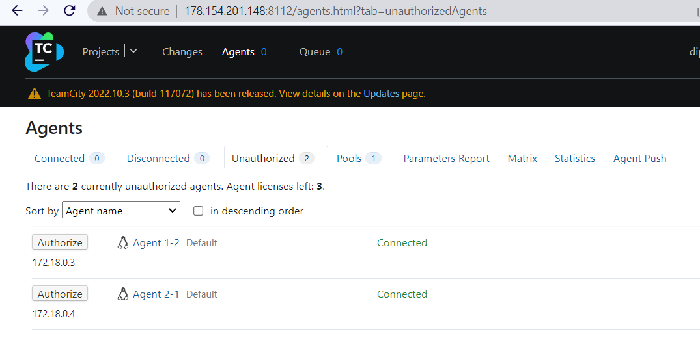

## Этап пятый (последный) -Установка и настройка системы CI/CD


В качестве ситемы CI/CD будем использовать [`TeamCity`](https://www.jetbrains.com/teamcity/) на отдельном от кластера Kubernetes инстансе в YandexCloud

1. Запускаем дополнительный инстанс в Yandex-cloud:
   
    * Добавляем инстансу 4 cpu, 4Gb RAM и 50Gb диск
    * Также не забывает добавить ключ ssh для подключения извне


2. Для запуска сервера и агентов [`Teamcity`](https://www.jetbrains.com/teamcity/) будем использовать готовые [`docker-compose`](https://docs.docker.com/compose/) манифесты 
   
   * Подключаемся и устанавливаем [`docker`](https://www.docker.com/), [`docker-compose`](https://docs.docker.com/compose/)

```shell
$ ssh ubuntu@178.154.201.148
dpopov@dpopov-test:~/teamcity-docker-samples/compose-windows$ ssh ubuntu@178.154.201.148
Welcome to Ubuntu 20.04.6 LTS (GNU/Linux 5.4.0-146-generic x86_64)
...

ubuntu@teamcity:~$ sudo apt update & sudo apt install -y git docker docker-compose htop
```

<details>
   <summary>Log</summary>

```shell
ubuntu@teamcity:~$ sudo apt update & sudo apt install -y git docker docker-compose htop
[1] 812
Reading package lists... Done
Hit:1 http://mirror.yandex.ru/ubuntu focal InRelease
Get:2 http://mirror.yandex.ru/ubuntu focal-updates InRelease [114 kB]
Get:3 http://mirror.yandex.ru/ubuntu focal-backports InRelease [108 kB]
Get:4 http://security.ubuntu.com/ubuntu focal-security InRelease [114 kB]
Building dependency tree       12%]
Reading state information... Done
Get:5 http://mirror.yandex.ru/ubuntu focal-updates/main i386 Packages [804 kB]
Get:6 http://mirror.yandex.ru/ubuntu focal-updates/main amd64 Packages [2,464 kB]
Get:7 http://mirror.yandex.ru/ubuntu focal-updates/main amd64 c-n-f Metadata [16.4 kB]
Get:8 http://mirror.yandex.ru/ubuntu focal-updates/universe amd64 Packages [1,046 kB]
Get:9 http://mirror.yandex.ru/ubuntu focal-updates/universe i386 Packages [721 kB]
Get:10 http://mirror.yandex.ru/ubuntu focal-updates/universe amd64 c-n-f Metadata [24.2 kB]
Get:11 http://mirror.yandex.ru/ubuntu focal-backports/main amd64 Packages [45.7 kB]
Get:12 http://mirror.yandex.ru/ubuntu focal-backports/main i386 Packages [36.1 kB]
Get:13 http://mirror.yandex.ru/ubuntu focal-backports/main amd64 c-n-f Metadata [1,420 B]
Get:14 http://mirror.yandex.ru/ubuntu focal-backports/universe amd64 Packages [24.9 kB]
Get:15 http://mirror.yandex.ru/ubuntu focal-backports/universe i386 Packages [13.8 kB]
Get:16 http://mirror.yandex.ru/ubuntu focal-backports/universe amd64 c-n-f Metadata [880 B]
0% [5 Packages store 0 B] [4 InRelease 25.8 kB/114 kB 23%]The following additional packages will be installed:
  bridge-utils containerd dns-root-data dnsmasq-base docker.io git-man libcurl3-gnutls liberror-perl libgdbm-compat4 libidn11 libperl5.30 patch perl perl-modules-5.30 pigz
  python3-cached-property python3-docker python3-dockerpty python3-docopt python3-texttable python3-websocket runc ubuntu-fan wmdocker
Suggested packages:
  ifupdown aufs-tools btrfs-progs cgroupfs-mount | cgroup-lite debootstrap docker-doc rinse zfs-fuse | zfsutils git-daemon-run | git-daemon-sysvinit git-doc git-el git-email git-gui
  gitk gitweb git-cvs git-mediawiki git-svn diffutils-doc perl-doc libterm-readline-gnu-perl | libterm-readline-perl-perl make libb-debug-perl liblocale-codes-perl
0% [6 Packages store 0 B] [4 InRelease 43.1 kB/114 kB 38%]The following NEW packages will be installed:
  bridge-utils containerd dns-root-data dnsmasq-base docker docker-compose docker.io git git-man htop libcurl3-gnutls liberror-perl libgdbm-compat4 libidn11 libperl5.30 patch perl
  perl-modules-5.30 pigz python3-cached-property python3-docker python3-dockerpty python3-docopt python3-texttable python3-websocket runc ubuntu-fan wmdocker
0 upgraded, 28 newly installed, 0 to remove and 0 not upgraded.
Need to get 79.1 MB of archives.
After this operation, 380 MB of additional disk space will be used.
Get:1 http://mirror.yandex.ru/ubuntu focal-updates/main amd64 perl-modules-5.30 all 5.30.0-9ubuntu0.3 [2,739 kB]
Get:2 http://mirror.yandex.ru/ubuntu focal/main amd64 libgdbm-compat4 amd64 1.18.1-5 [6,244 B]
Get:3 http://mirror.yandex.ru/ubuntu focal-updates/main amd64 libperl5.30 amd64 5.30.0-9ubuntu0.3 [3,951 kB]
Get:4 http://mirror.yandex.ru/ubuntu focal-updates/main amd64 perl amd64 5.30.0-9ubuntu0.3 [224 kB]
Get:5 http://mirror.yandex.ru/ubuntu focal/universe amd64 pigz amd64 2.4-1 [57.4 kB]
Get:6 http://mirror.yandex.ru/ubuntu focal/main amd64 bridge-utils amd64 1.6-2ubuntu1 [30.5 kB]
Get:7 http://mirror.yandex.ru/ubuntu focal-updates/main amd64 runc amd64 1.1.4-0ubuntu1~20.04.1 [3,817 kB]
Get:17 http://security.ubuntu.com/ubuntu focal-security/main i386 Packages [574 kB]
Get:8 http://mirror.yandex.ru/ubuntu focal-updates/main amd64 containerd amd64 1.6.12-0ubuntu1~20.04.1 [31.4 MB]
Get:18 http://security.ubuntu.com/ubuntu focal-security/main amd64 Packages [2,082 kB]
Get:19 http://security.ubuntu.com/ubuntu focal-security/main Translation-en [338 kB]
Get:20 http://security.ubuntu.com/ubuntu focal-security/main amd64 c-n-f Metadata [12.5 kB]
Get:21 http://security.ubuntu.com/ubuntu focal-security/universe i386 Packages [590 kB]
Get:22 http://security.ubuntu.com/ubuntu focal-security/universe amd64 Packages [820 kB]
Get:23 http://security.ubuntu.com/ubuntu focal-security/universe amd64 c-n-f Metadata [17.6 kB]
Fetched 9,970 kB in 2s (4,523 kB/s)7%]
Get:9 http://mirror.yandex.ru/ubuntu focal/main amd64 dns-root-data all 2019052802 [5,300 B]
Get:10 http://mirror.yandex.ru/ubuntu focal/main amd64 libidn11 amd64 1.33-2.2ubuntu2 [46.2 kB]
Get:11 http://mirror.yandex.ru/ubuntu focal-updates/main amd64 dnsmasq-base amd64 2.80-1.1ubuntu1.6 [315 kB]
Get:12 http://mirror.yandex.ru/ubuntu focal/universe amd64 wmdocker amd64 1.5-2 [13.0 kB]
Get:13 http://mirror.yandex.ru/ubuntu focal/universe amd64 docker all 1.5-2 [1,316 B]
Get:14 http://mirror.yandex.ru/ubuntu focal/universe amd64 python3-cached-property all 1.5.1-4 [10.9 kB]
Get:15 http://mirror.yandex.ru/ubuntu focal/universe amd64 python3-websocket all 0.53.0-2ubuntu1 [32.3 kB]
Get:16 http://mirror.yandex.ru/ubuntu focal/universe amd64 python3-docker all 4.1.0-1 [83.8 kB]
Get:17 http://mirror.yandex.ru/ubuntu focal/universe amd64 python3-dockerpty all 0.4.1-2 [11.1 kB]
Get:18 http://mirror.yandex.ru/ubuntu focal/universe amd64 python3-docopt all 0.6.2-2.2ubuntu1 [19.7 kB]
Get:19 http://mirror.yandex.ru/ubuntu focal/universe amd64 python3-texttable all 1.6.2-2 [11.0 kB]
Get:20 http://mirror.yandex.ru/ubuntu focal/universe amd64 docker-compose all 1.25.0-1 [92.7 kB]
Get:21 http://mirror.yandex.ru/ubuntu focal-updates/universe amd64 docker.io amd64 20.10.21-0ubuntu1~20.04.1 [30.3 MB]
Reading package lists... Done3 MB 41%]                                                                                                                                     7,774 kB/s 3s
Building dependency tree       MB 55%]                                                                                                                                     7,774 kB/s 2s
Reading state information... Done
5 packages can be upgraded. Run 'apt list --upgradable' to see them.
Get:22 http://mirror.yandex.ru/ubuntu focal-updates/main amd64 libcurl3-gnutls amd64 7.68.0-1ubuntu2.18 [233 kB]
Get:23 http://mirror.yandex.ru/ubuntu focal/main amd64 liberror-perl all 0.17029-1 [26.5 kB]
Get:24 http://mirror.yandex.ru/ubuntu focal-updates/main amd64 git-man all 1:2.25.1-1ubuntu3.10 [887 kB]
Get:25 http://mirror.yandex.ru/ubuntu focal-updates/main amd64 git amd64 1:2.25.1-1ubuntu3.10 [4,534 kB]
Get:26 http://mirror.yandex.ru/ubuntu focal/main amd64 htop amd64 2.2.0-2build1 [80.5 kB]
Get:27 http://mirror.yandex.ru/ubuntu focal/main amd64 patch amd64 2.7.6-6 [105 kB]
Get:28 http://mirror.yandex.ru/ubuntu focal-updates/main amd64 ubuntu-fan all 0.12.13ubuntu0.1 [34.4 kB]
Fetched 79.1 MB in 11s (7,360 kB/s)
Preconfiguring packages ...
Selecting previously unselected package perl-modules-5.30.
(Reading database ... 102566 files and directories currently installed.)
Preparing to unpack .../00-perl-modules-5.30_5.30.0-9ubuntu0.3_all.deb ...
Unpacking perl-modules-5.30 (5.30.0-9ubuntu0.3) ...
Selecting previously unselected package libgdbm-compat4:amd64.
Preparing to unpack .../01-libgdbm-compat4_1.18.1-5_amd64.deb ...
Unpacking libgdbm-compat4:amd64 (1.18.1-5) ...
Selecting previously unselected package libperl5.30:amd64.
Preparing to unpack .../02-libperl5.30_5.30.0-9ubuntu0.3_amd64.deb ...
Unpacking libperl5.30:amd64 (5.30.0-9ubuntu0.3) ...
Selecting previously unselected package perl.
Preparing to unpack .../03-perl_5.30.0-9ubuntu0.3_amd64.deb ...
Unpacking perl (5.30.0-9ubuntu0.3) ...
Selecting previously unselected package pigz.
Preparing to unpack .../04-pigz_2.4-1_amd64.deb ...
Unpacking pigz (2.4-1) ...
Selecting previously unselected package bridge-utils.
Preparing to unpack .../05-bridge-utils_1.6-2ubuntu1_amd64.deb ...
Unpacking bridge-utils (1.6-2ubuntu1) ...
Selecting previously unselected package runc.
Preparing to unpack .../06-runc_1.1.4-0ubuntu1~20.04.1_amd64.deb ...
Unpacking runc (1.1.4-0ubuntu1~20.04.1) ...
Selecting previously unselected package containerd.
Preparing to unpack .../07-containerd_1.6.12-0ubuntu1~20.04.1_amd64.deb ...
Unpacking containerd (1.6.12-0ubuntu1~20.04.1) ...
Selecting previously unselected package dns-root-data.
Preparing to unpack .../08-dns-root-data_2019052802_all.deb ...
Unpacking dns-root-data (2019052802) ...
Selecting previously unselected package libidn11:amd64.
Preparing to unpack .../09-libidn11_1.33-2.2ubuntu2_amd64.deb ...
Unpacking libidn11:amd64 (1.33-2.2ubuntu2) ...
Selecting previously unselected package dnsmasq-base.
Preparing to unpack .../10-dnsmasq-base_2.80-1.1ubuntu1.6_amd64.deb ...
Unpacking dnsmasq-base (2.80-1.1ubuntu1.6) ...
Selecting previously unselected package wmdocker.
Preparing to unpack .../11-wmdocker_1.5-2_amd64.deb ...
Unpacking wmdocker (1.5-2) ...
Selecting previously unselected package docker.
Preparing to unpack .../12-docker_1.5-2_all.deb ...
Unpacking docker (1.5-2) ...
Selecting previously unselected package python3-cached-property.
Preparing to unpack .../13-python3-cached-property_1.5.1-4_all.deb ...
Unpacking python3-cached-property (1.5.1-4) ...
Selecting previously unselected package python3-websocket.
Preparing to unpack .../14-python3-websocket_0.53.0-2ubuntu1_all.deb ...
Unpacking python3-websocket (0.53.0-2ubuntu1) ...
Selecting previously unselected package python3-docker.
Preparing to unpack .../15-python3-docker_4.1.0-1_all.deb ...
Unpacking python3-docker (4.1.0-1) ...
Selecting previously unselected package python3-dockerpty.
Preparing to unpack .../16-python3-dockerpty_0.4.1-2_all.deb ...
Unpacking python3-dockerpty (0.4.1-2) ...
Selecting previously unselected package python3-docopt.
Preparing to unpack .../17-python3-docopt_0.6.2-2.2ubuntu1_all.deb ...
Unpacking python3-docopt (0.6.2-2.2ubuntu1) ...
Selecting previously unselected package python3-texttable.
Preparing to unpack .../18-python3-texttable_1.6.2-2_all.deb ...
Unpacking python3-texttable (1.6.2-2) ...
Selecting previously unselected package docker-compose.
Preparing to unpack .../19-docker-compose_1.25.0-1_all.deb ...
Unpacking docker-compose (1.25.0-1) ...
Selecting previously unselected package docker.io.
Preparing to unpack .../20-docker.io_20.10.21-0ubuntu1~20.04.1_amd64.deb ...
Unpacking docker.io (20.10.21-0ubuntu1~20.04.1) ...
Selecting previously unselected package libcurl3-gnutls:amd64.
Preparing to unpack .../21-libcurl3-gnutls_7.68.0-1ubuntu2.18_amd64.deb ...
Unpacking libcurl3-gnutls:amd64 (7.68.0-1ubuntu2.18) ...
Selecting previously unselected package liberror-perl.
Preparing to unpack .../22-liberror-perl_0.17029-1_all.deb ...
Unpacking liberror-perl (0.17029-1) ...
Selecting previously unselected package git-man.
Preparing to unpack .../23-git-man_1%3a2.25.1-1ubuntu3.10_all.deb ...
Unpacking git-man (1:2.25.1-1ubuntu3.10) ...
Selecting previously unselected package git.
Preparing to unpack .../24-git_1%3a2.25.1-1ubuntu3.10_amd64.deb ...
Unpacking git (1:2.25.1-1ubuntu3.10) ...
Selecting previously unselected package htop.
Preparing to unpack .../25-htop_2.2.0-2build1_amd64.deb ...
Unpacking htop (2.2.0-2build1) ...
Selecting previously unselected package patch.
Preparing to unpack .../26-patch_2.7.6-6_amd64.deb ...
Unpacking patch (2.7.6-6) ...
Selecting previously unselected package ubuntu-fan.
Preparing to unpack .../27-ubuntu-fan_0.12.13ubuntu0.1_all.deb ...
Unpacking ubuntu-fan (0.12.13ubuntu0.1) ...
Setting up python3-cached-property (1.5.1-4) ...
Setting up python3-texttable (1.6.2-2) ...
Setting up python3-docopt (0.6.2-2.2ubuntu1) ...
Setting up perl-modules-5.30 (5.30.0-9ubuntu0.3) ...
Setting up htop (2.2.0-2build1) ...
Setting up wmdocker (1.5-2) ...
Setting up libcurl3-gnutls:amd64 (7.68.0-1ubuntu2.18) ...
Setting up runc (1.1.4-0ubuntu1~20.04.1) ...
Setting up dns-root-data (2019052802) ...
Setting up libidn11:amd64 (1.33-2.2ubuntu2) ...
Setting up patch (2.7.6-6) ...
Setting up libgdbm-compat4:amd64 (1.18.1-5) ...
Setting up bridge-utils (1.6-2ubuntu1) ...
Setting up pigz (2.4-1) ...
Setting up libperl5.30:amd64 (5.30.0-9ubuntu0.3) ...
Setting up git-man (1:2.25.1-1ubuntu3.10) ...
Setting up containerd (1.6.12-0ubuntu1~20.04.1) ...
Created symlink /etc/systemd/system/multi-user.target.wants/containerd.service → /lib/systemd/system/containerd.service.
Setting up python3-websocket (0.53.0-2ubuntu1) ...
update-alternatives: using /usr/bin/python3-wsdump to provide /usr/bin/wsdump (wsdump) in auto mode
Setting up python3-dockerpty (0.4.1-2) ...
Setting up docker (1.5-2) ...
Setting up python3-docker (4.1.0-1) ...
Setting up docker.io (20.10.21-0ubuntu1~20.04.1) ...
Adding group `docker' (GID 115) ...
Done.
Created symlink /etc/systemd/system/multi-user.target.wants/docker.service → /lib/systemd/system/docker.service.
Created symlink /etc/systemd/system/sockets.target.wants/docker.socket → /lib/systemd/system/docker.socket.
Setting up dnsmasq-base (2.80-1.1ubuntu1.6) ...
Setting up perl (5.30.0-9ubuntu0.3) ...
Setting up ubuntu-fan (0.12.13ubuntu0.1) ...
Created symlink /etc/systemd/system/multi-user.target.wants/ubuntu-fan.service → /lib/systemd/system/ubuntu-fan.service.
Setting up docker-compose (1.25.0-1) ...
Setting up liberror-perl (0.17029-1) ...
Setting up git (1:2.25.1-1ubuntu3.10) ...
Processing triggers for libc-bin (2.31-0ubuntu9.9) ...
Processing triggers for systemd (245.4-4ubuntu3.20) ...
Processing triggers for man-db (2.9.1-1) ...
Processing triggers for dbus (1.12.16-2ubuntu2.3) ...
Processing triggers for mime-support (3.64ubuntu1) ...

```
</details>


3. Клонируем репозиторий с [манифестами](https://github.com/rowhe/teamcity-docker-samples.git)  

```shell
ubuntu@teamcity:~$ git clone https://github.com/rowhe/teamcity-docker-samples.git
Cloning into 'teamcity-docker-samples'...
remote: Enumerating objects: 91, done.
remote: Counting objects: 100% (13/13), done.
remote: Compressing objects: 100% (7/7), done.
remote: Total 91 (delta 6), reused 6 (delta 6), pack-reused 78
Unpacking objects: 100% (91/91), 17.35 KiB | 1.08 MiB/s, done.
ubuntu@teamcity:~$
```

4. Добавляем своего пользователя в группу `docker` для возможности запуска контейнеров без команды sudo и перелогиниваемся

```shell
ubuntu@teamcity:~$ sudo usermod -aG docker ubuntu
ubuntu@teamcity:~$ ^D
```

5. Запускаем контейнеры предварительно изменив пользователя и пароль к ДБ в манифесте `docker-compose.yaml`

```shell
ubuntu@teamcity:~$ cd teamcity-docker-samples/compose-ubuntu/
ubuntu@teamcity:~/teamcity-docker-samples/compose-ubuntu$ docker-compose up -d
Creating network "compose-ubuntu_default" with the default driver
Pulling db (postgres:latest)...
...
Status: Downloaded newer image for postgres:latest
Pulling teamcity (jetbrains/teamcity-server:2021.1)...
...
Status: Downloaded newer image for jetbrains/teamcity-server:2021.1
Pulling teamcity-agent-1 (jetbrains/teamcity-agent:2021.1-linux-sudo)...
...
Status: Downloaded newer image for jetbrains/teamcity-agent:2021.1-linux-sudo
Creating compose-ubuntu_db_1               ... done
Creating compose-ubuntu_teamcity-agent-1_1 ... done
Creating compose-ubuntu_teamcity-agent-2_1 ... done
Creating compose-ubuntu_teamcity_1         ... done
ubuntu@teamcity:~/teamcity-docker-samples/compose-ubuntu$
```

6. Получаем токен администратора `Teamcity` и логинимся

```shell
ubuntu@teamcity:~/teamcity-docker-samples/compose-ubuntu$ docker logs 2907af79b458 |grep token
[TeamCity] Super user authentication token: 39616*********44220 (use empty username with the token as the password to access the server)
ubuntu@teamcity:~/teamcity-docker-samples/compose-ubuntu$
```

7. Создаем пользователя для управления конфигурацией `Teamcity` и перелогиниваемся под ним


8. После этого необходимо авторизовать агентов



9. Создаем проект


10. Добавим _connection_ для подключения к регистри docker.io


10. Установим [`git`](https://git-scm.com/), [`helm`](https://helm.sh/) [`kubectl`](https://kubernetes.io/docs/tasks/tools/) и перенесем конфиг `.kube/config` из кластера на агенты

```shell
$ sudo docker exec -it c5c882b3cf59 sudo curl -LO https://storage.googleapis.com/kubernetes-release/release/`curl -s https://storage.googleapis.com/kubernetes-release/release/stable.txt`/bin/linux/amd64/kubectl
  % Total    % Received % Xferd  Average Speed   Time    Time     Time  Current
                                 Dload  Upload   Total   Spent    Left  Speed
100 45.8M  100 45.8M    0     0  21.6M      0  0:00:02  0:00:02 --:--:-- 21.6M
$ sudo docker exec -it c5c882b3cf59 sudo chmod +x kubectl
$ sudo docker exec -it c5c882b3cf59 sudo mv kubectl /usr/local/bin/

$ sudo docker exec -it c5c882b3cf59 sudo apt install git
Reading package lists... Done
Building dependency tree
Reading state information... Done
...
Setting up git (1:2.25.1-1ubuntu3.10) ...

$ curl -fsSL -o get_helm.sh https://raw.githubusercontent.com/helm/helm/main/scripts/get-helm-3
$ chmod 700 get_helm.sh
$ ./get_helm.sh
Downloading https://get.helm.sh/helm-v3.11.2-linux-amd64.tar.gz
Verifying checksum... Done.
Preparing to install helm into /usr/local/bin
helm installed into /usr/local/bin/helm
```


