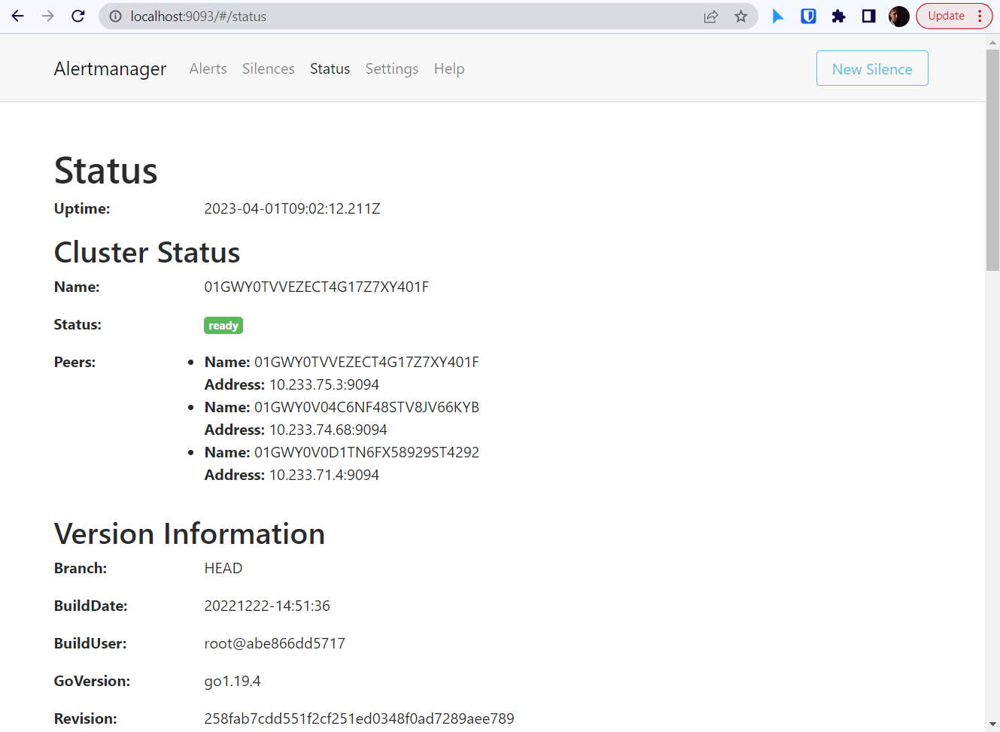

## Этап четверный - Подготовка cистемы мониторинга и деплой приложения

1. В качестве системы мониторинга будем использовать пакет [`kube-prometheus`](https://github.com/prometheus-operator/kube-prometheus)

Клонируем репозиторий локально:
```shell
dpopov@dpopov-test:~$ git clone git@github.com:prometheus-operator/kube-prometheus.git
Cloning into 'kube-prometheus'...
remote: Enumerating objects: 17818, done.
remote: Counting objects: 100% (137/137), done.
remote: Compressing objects: 100% (66/66), done.
remote: Total 17818 (delta 80), reused 118 (delta 64), pack-reused 17681
Receiving objects: 100% (17818/17818), 9.44 MiB | 7.13 MiB/s, done.
Resolving deltas: 100% (11779/11779), done.


```

Выполним необходимые команды для установки мониторинка в [подготовленный](../terraform/README.md) в YandexCloud [кластер](../ansible/README.md) `Kubernetes`

```shell
dpopov@dpopov-test:~$ cd kube-prometheus/

dpopdpopov@dpopov-test:~/kube-prometheus$ kubectl apply --server-side -f manifests/setup
```

<details>
    <summary>Log</summary>

```shell
dpopdpopov@dpopov-test:~/kube-prometheus$ kubectl apply --server-side -f manifests/setup
customresourcedefinition.apiextensions.k8s.io/alertmanagerconfigs.monitoring.coreos.com serverside-applied
customresourcedefinition.apiextensions.k8s.io/alertmanagers.monitoring.coreos.com serverside-applied
customresourcedefinition.apiextensions.k8s.io/podmonitors.monitoring.coreos.com serverside-applied
customresourcedefinition.apiextensions.k8s.io/probes.monitoring.coreos.com serverside-applied
customresourcedefinition.apiextensions.k8s.io/prometheuses.monitoring.coreos.com serverside-applied
customresourcedefinition.apiextensions.k8s.io/prometheusagents.monitoring.coreos.com serverside-applied
customresourcedefinition.apiextensions.k8s.io/prometheusrules.monitoring.coreos.com serverside-applied
customresourcedefinition.apiextensions.k8s.io/servicemonitors.monitoring.coreos.com serverside-applied
customresourcedefinition.apiextensions.k8s.io/thanosrulers.monitoring.coreos.com serverside-applied
namespace/monitoring serverside-applied
```
</details>


```shell
dpopov@dpopov-test:~/kube-prometheus$ kubectl wait \
> --for condition=Established \
> --all CustomResourceDefinition \
> --namespace=monitoring
```

<details>
    <summary>Log</summary>

```shell
dpopov@dpopov-test:~/kube-prometheus$ kubectl wait \
> --for condition=Established \
> --all CustomResourceDefinition \
> --namespace=monitoring
customresourcedefinition.apiextensions.k8s.io/alertmanagerconfigs.monitoring.coreos.com condition met
customresourcedefinition.apiextensions.k8s.io/alertmanagers.monitoring.coreos.com condition met
customresourcedefinition.apiextensions.k8s.io/bgpconfigurations.crd.projectcalico.org condition met
customresourcedefinition.apiextensions.k8s.io/bgppeers.crd.projectcalico.org condition met
customresourcedefinition.apiextensions.k8s.io/blockaffinities.crd.projectcalico.org condition met
customresourcedefinition.apiextensions.k8s.io/caliconodestatuses.crd.projectcalico.org condition met
customresourcedefinition.apiextensions.k8s.io/clusterinformations.crd.projectcalico.org condition met
customresourcedefinition.apiextensions.k8s.io/felixconfigurations.crd.projectcalico.org condition met
customresourcedefinition.apiextensions.k8s.io/globalnetworkpolicies.crd.projectcalico.org condition met
customresourcedefinition.apiextensions.k8s.io/globalnetworksets.crd.projectcalico.org condition met
customresourcedefinition.apiextensions.k8s.io/hostendpoints.crd.projectcalico.org condition met
customresourcedefinition.apiextensions.k8s.io/ipamblocks.crd.projectcalico.org condition met
customresourcedefinition.apiextensions.k8s.io/ipamconfigs.crd.projectcalico.org condition met
customresourcedefinition.apiextensions.k8s.io/ipamhandles.crd.projectcalico.org condition met
customresourcedefinition.apiextensions.k8s.io/ippools.crd.projectcalico.org condition met
customresourcedefinition.apiextensions.k8s.io/ipreservations.crd.projectcalico.org condition met
customresourcedefinition.apiextensions.k8s.io/kubecontrollersconfigurations.crd.projectcalico.org condition met
customresourcedefinition.apiextensions.k8s.io/networkpolicies.crd.projectcalico.org condition met
customresourcedefinition.apiextensions.k8s.io/networksets.crd.projectcalico.org condition met
customresourcedefinition.apiextensions.k8s.io/podmonitors.monitoring.coreos.com condition met
customresourcedefinition.apiextensions.k8s.io/probes.monitoring.coreos.com condition met
customresourcedefinition.apiextensions.k8s.io/prometheusagents.monitoring.coreos.com condition met
customresourcedefinition.apiextensions.k8s.io/prometheuses.monitoring.coreos.com condition met
customresourcedefinition.apiextensions.k8s.io/prometheusrules.monitoring.coreos.com condition met
customresourcedefinition.apiextensions.k8s.io/servicemonitors.monitoring.coreos.com condition met
customresourcedefinition.apiextensions.k8s.io/thanosrulers.monitoring.coreos.com condition met
```
</details>


```shell
dpopov@dpopov-test:~/kube-prometheus$ kubectl apply -f manifests/
```

<details>
    <summary>Log</summary>

```shell
dpopov@dpopov-test:~/kube-prometheus$ kubectl apply -f manifests/
alertmanager.monitoring.coreos.com/main created
networkpolicy.networking.k8s.io/alertmanager-main created
poddisruptionbudget.policy/alertmanager-main created
prometheusrule.monitoring.coreos.com/alertmanager-main-rules created
secret/alertmanager-main created
service/alertmanager-main created
serviceaccount/alertmanager-main created
servicemonitor.monitoring.coreos.com/alertmanager-main created
clusterrole.rbac.authorization.k8s.io/blackbox-exporter created
clusterrolebinding.rbac.authorization.k8s.io/blackbox-exporter created
configmap/blackbox-exporter-configuration created
deployment.apps/blackbox-exporter created
networkpolicy.networking.k8s.io/blackbox-exporter created
service/blackbox-exporter created
serviceaccount/blackbox-exporter created
servicemonitor.monitoring.coreos.com/blackbox-exporter created
secret/grafana-config created
secret/grafana-datasources created
configmap/grafana-dashboard-alertmanager-overview created
configmap/grafana-dashboard-apiserver created
configmap/grafana-dashboard-cluster-total created
configmap/grafana-dashboard-controller-manager created
configmap/grafana-dashboard-grafana-overview created
configmap/grafana-dashboard-k8s-resources-cluster created
configmap/grafana-dashboard-k8s-resources-namespace created
configmap/grafana-dashboard-k8s-resources-node created
configmap/grafana-dashboard-k8s-resources-pod created
configmap/grafana-dashboard-k8s-resources-workload created
configmap/grafana-dashboard-k8s-resources-workloads-namespace created
configmap/grafana-dashboard-kubelet created
configmap/grafana-dashboard-namespace-by-pod created
configmap/grafana-dashboard-namespace-by-workload created
configmap/grafana-dashboard-node-cluster-rsrc-use created
configmap/grafana-dashboard-node-rsrc-use created
configmap/grafana-dashboard-nodes-darwin created
configmap/grafana-dashboard-nodes created
configmap/grafana-dashboard-persistentvolumesusage created
configmap/grafana-dashboard-pod-total created
configmap/grafana-dashboard-prometheus-remote-write created
configmap/grafana-dashboard-prometheus created
configmap/grafana-dashboard-proxy created
configmap/grafana-dashboard-scheduler created
configmap/grafana-dashboard-workload-total created
configmap/grafana-dashboards created
deployment.apps/grafana created
networkpolicy.networking.k8s.io/grafana created
prometheusrule.monitoring.coreos.com/grafana-rules created
service/grafana created
serviceaccount/grafana created
servicemonitor.monitoring.coreos.com/grafana created
prometheusrule.monitoring.coreos.com/kube-prometheus-rules created
clusterrole.rbac.authorization.k8s.io/kube-state-metrics created
clusterrolebinding.rbac.authorization.k8s.io/kube-state-metrics created
deployment.apps/kube-state-metrics created
networkpolicy.networking.k8s.io/kube-state-metrics created
prometheusrule.monitoring.coreos.com/kube-state-metrics-rules created
service/kube-state-metrics created
serviceaccount/kube-state-metrics created
servicemonitor.monitoring.coreos.com/kube-state-metrics created
prometheusrule.monitoring.coreos.com/kubernetes-monitoring-rules created
servicemonitor.monitoring.coreos.com/kube-apiserver created
servicemonitor.monitoring.coreos.com/coredns created
servicemonitor.monitoring.coreos.com/kube-controller-manager created
servicemonitor.monitoring.coreos.com/kube-scheduler created
servicemonitor.monitoring.coreos.com/kubelet created
clusterrole.rbac.authorization.k8s.io/node-exporter created
clusterrolebinding.rbac.authorization.k8s.io/node-exporter created
daemonset.apps/node-exporter created
networkpolicy.networking.k8s.io/node-exporter created
prometheusrule.monitoring.coreos.com/node-exporter-rules created
service/node-exporter created
serviceaccount/node-exporter created
servicemonitor.monitoring.coreos.com/node-exporter created
clusterrole.rbac.authorization.k8s.io/prometheus-k8s created
clusterrolebinding.rbac.authorization.k8s.io/prometheus-k8s created
networkpolicy.networking.k8s.io/prometheus-k8s created
poddisruptionbudget.policy/prometheus-k8s created
prometheus.monitoring.coreos.com/k8s created
prometheusrule.monitoring.coreos.com/prometheus-k8s-prometheus-rules created
rolebinding.rbac.authorization.k8s.io/prometheus-k8s-config created
rolebinding.rbac.authorization.k8s.io/prometheus-k8s created
rolebinding.rbac.authorization.k8s.io/prometheus-k8s created
rolebinding.rbac.authorization.k8s.io/prometheus-k8s created
role.rbac.authorization.k8s.io/prometheus-k8s-config created
role.rbac.authorization.k8s.io/prometheus-k8s created
role.rbac.authorization.k8s.io/prometheus-k8s created
role.rbac.authorization.k8s.io/prometheus-k8s created
service/prometheus-k8s created
serviceaccount/prometheus-k8s created
servicemonitor.monitoring.coreos.com/prometheus-k8s created
apiservice.apiregistration.k8s.io/v1beta1.metrics.k8s.io created
clusterrole.rbac.authorization.k8s.io/prometheus-adapter created
clusterrole.rbac.authorization.k8s.io/system:aggregated-metrics-reader created
clusterrolebinding.rbac.authorization.k8s.io/prometheus-adapter created
clusterrolebinding.rbac.authorization.k8s.io/resource-metrics:system:auth-delegator created
clusterrole.rbac.authorization.k8s.io/resource-metrics-server-resources created
configmap/adapter-config created
deployment.apps/prometheus-adapter created
networkpolicy.networking.k8s.io/prometheus-adapter created
poddisruptionbudget.policy/prometheus-adapter created
rolebinding.rbac.authorization.k8s.io/resource-metrics-auth-reader created
service/prometheus-adapter created
serviceaccount/prometheus-adapter created
servicemonitor.monitoring.coreos.com/prometheus-adapter created
clusterrole.rbac.authorization.k8s.io/prometheus-operator created
clusterrolebinding.rbac.authorization.k8s.io/prometheus-operator created
deployment.apps/prometheus-operator created
networkpolicy.networking.k8s.io/prometheus-operator created
prometheusrule.monitoring.coreos.com/prometheus-operator-rules created
service/prometheus-operator created
serviceaccount/prometheus-operator created
servicemonitor.monitoring.coreos.com/prometheus-operator created

```
</details>


Проверим работу подов системы мониторинга:

```shell
dpopov@dpopov-test:~/kube-prometheus$ kubectl get po,svc,sts -n monitoring

NAME                                       READY   STATUS    RESTARTS   AGE
pod/alertmanager-main-0                    2/2     Running   0          33m
pod/alertmanager-main-1                    2/2     Running   0          33m
pod/alertmanager-main-2                    2/2     Running   0          33m
pod/blackbox-exporter-6fd586b445-vwz4w     3/3     Running   0          33m
pod/grafana-56c4977497-vksl8               1/1     Running   0          33m
pod/kube-state-metrics-9c686fb69-b7j7w     3/3     Running   0          33m
pod/node-exporter-66856                    2/2     Running   0          33m
pod/node-exporter-cd7wl                    2/2     Running   0          33m
pod/node-exporter-ss9z9                    2/2     Running   0          33m
pod/node-exporter-wdmpm                    2/2     Running   0          33m
pod/prometheus-adapter-77f56b865b-8vr6s    1/1     Running   0          33m
pod/prometheus-adapter-77f56b865b-9lxg6    1/1     Running   0          33m
pod/prometheus-k8s-0                       2/2     Running   0          33m
pod/prometheus-k8s-1                       2/2     Running   0          33m
pod/prometheus-operator-6d67d66f57-k97vx   2/2     Running   0          33m

NAME                            TYPE        CLUSTER-IP      EXTERNAL-IP   PORT(S)                      AGE
service/alertmanager-main       ClusterIP   10.233.35.59    <none>        9093/TCP,8080/TCP            33m
service/alertmanager-operated   ClusterIP   None            <none>        9093/TCP,9094/TCP,9094/UDP   33m
service/blackbox-exporter       ClusterIP   10.233.61.83    <none>        9115/TCP,19115/TCP           33m
service/grafana                 ClusterIP   10.233.32.190   <none>        3000/TCP                     33m
service/kube-state-metrics      ClusterIP   None            <none>        8443/TCP,9443/TCP            33m
service/node-exporter           ClusterIP   None            <none>        9100/TCP                     33m
service/prometheus-adapter      ClusterIP   10.233.45.162   <none>        443/TCP                      33m
service/prometheus-k8s          ClusterIP   10.233.52.60    <none>        9090/TCP,8080/TCP            33m
service/prometheus-operated     ClusterIP   None            <none>        9090/TCP                     33m
service/prometheus-operator     ClusterIP   None            <none>        8443/TCP                     33m

NAME                                 READY   AGE
statefulset.apps/alertmanager-main   3/3     33m
statefulset.apps/prometheus-k8s      2/2     33m


```


Проверим работы системы мониторинга:

Включим форвардинг для сервисов `grafana`, `prometheus-k8s` и `alertmanater-main`

```shell
dpopov@dpopov ~
$ kubectl.exe -n monitoring port-forward svc/grafana 3000 & kubectl --namespace monitoring port-forward svc/prometheus-k8s 9090  & kubectl --namespace monitoring port-forward svc/alertmanager-main 9093 &
[1] 609
[2] 610
[3] 611

dpopov@dpopov ~
$ Forwarding from 127.0.0.1:3000 -> 3000
Forwarding from [::1]:3000 -> 3000
Forwarding from 127.0.0.1:9090 -> 9090
Forwarding from [::1]:9090 -> 9090
Forwarding from 127.0.0.1:9093 -> 9093
Forwarding from [::1]:9093 -> 9093
```

### Подключимся к `grafana` по адресу `localhost:3000`


### Проверим, что статистика кластера собирается 


### Открываем `prometheus` по адресу `localhost:9090`


### Убеждаемся, что `alertmanager` также доступен по адресу `localhost:9093`




2. Подготовим деплой нашего [приложения](../app/README.md) при помощи [`Helm`](https://helm.sh/)

Создаем чарт:

```shell
$ helm create simple-nginx
Creating simple-nginx
```

Удалим все лишние директории и файлы кроме values.yaml  templates/simple-nginx.yaml
Подготовим конфигурацию деплоймета:


### simple-nginx.yaml
```shell
apiVersion: apps/v1
kind: Deployment
metadata:
  name: nginx
spec:
  selector:
    matchLabels:
      app: nginx
  template:
    metadata:
      labels:
        app: nginx
    spec:
      containers:
        - name: nginx
          image: "{{.Values.image.repository }}:{{ .Values.image.tag }}"
          imagePullPolicy: IfNotPresent
          ports:
---
apiVersion: v1
kind: Service
metadata:
  name: nginx
spec:
  type: NodePort
  ports:
  - port: {{ .Values.service.port }}
    nodePort: {{ .Values.service.nodePort }}
  selector:
    app: nginx
---
```


### values.yaml
```shell
replicaCount: 1
image:
  repository: rowhe/nginx_static_index
  tag: "latest"
service:
  type: NodePort
  port: 80
  nodePort: 30001
```


Применяем конфигурацию `helm`

```shell
$ helm install simp-nginx simple-nginx
NAME: simp-nginx
LAST DEPLOYED: Sat Apr  1 14:15:42 2023
NAMESPACE: default
STATUS: deployed
REVISION: 1
TEST SUITE: None
```

Убеждаемся, что деплоймент запустился

```shell
$ kubectl get po -o wide
NAME                     READY   STATUS    RESTARTS   AGE   IP            NODE    NOMINATED NODE   READINESS GATES
nginx-7dfc755cc7-8pmfp   1/1     Running   0          65s   10.233.71.7   node3   <none>           <none>
```

Также проверим в браузере, что приложение доступно из интернета


## Итог этапа - Подготовлена cистема мониторинга и произведен деплой приложения

## Следующий этап - [Установка и настройка](../ci-cd/README.md) CI/CD

