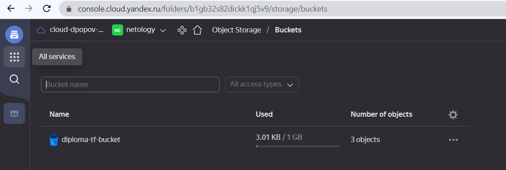
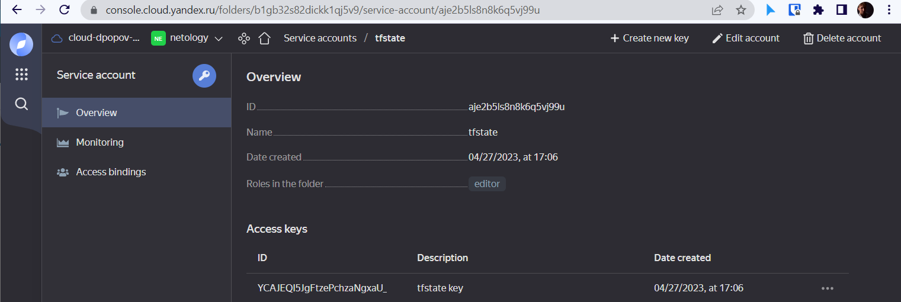
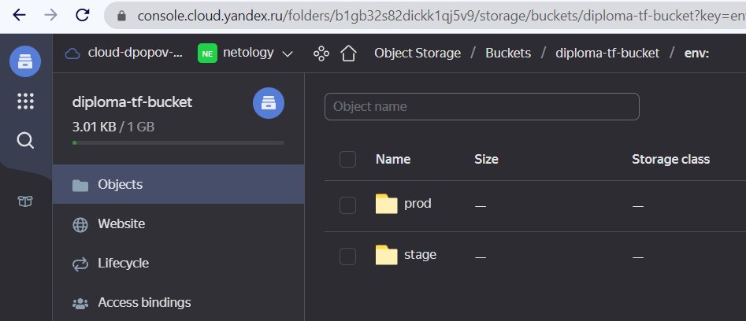
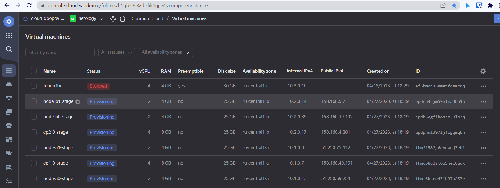
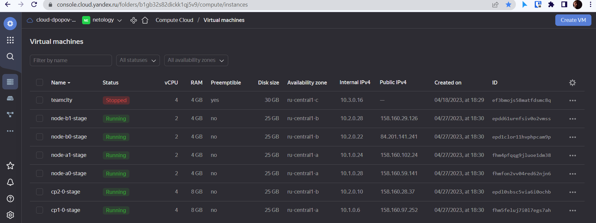
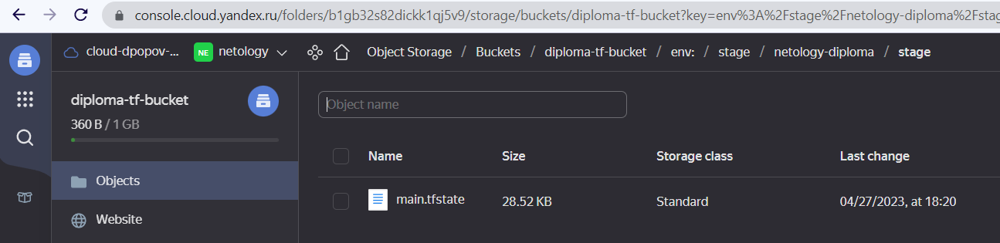
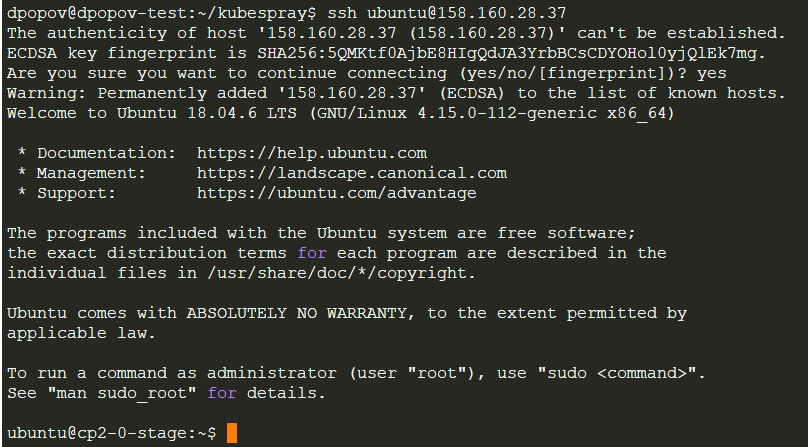

# Этап первый - Создание облачной инфраструктуры

## Цель этапа

На данном этапе в облачном провайдере _YandexCloud_ будет развернута инфрастура из нескольких виртуальных машин при помощи _Terraform_.

1. Вручную создадим _Object Storage_ в _YandexCloud_ и назовем его `diploma-tf-bucket`



2. Также создадим _service account_ и сгенерируем _static access key_ для доступа к хранилищу



3. Создадим конфигурацию _terraform_ 

- main.tf

```json
terraform {
  required_providers {
    yandex = {
      source = "yandex-cloud/yandex"
    }
  }
  required_version = ">= 0.13"
}

provider "yandex" {
  token		= var.yc_token
  cloud_id	= var.yc_cloud_id
  zone		= var.yc_region_a
  folder_id	= var.yc_folder_id
}

resource "yandex_vpc_network" "diploma_network" {
  name = "diploma-net"
}

resource "yandex_vpc_subnet" "subnet10_1" {
  v4_cidr_blocks = ["10.1.0.0/16"]
  zone           = var.yc_region_a
  network_id     = yandex_vpc_network.diploma_network.id
}

resource "yandex_vpc_subnet" "subnet10_2" {
  v4_cidr_blocks = ["10.2.0.0/16"]
  zone           = var.yc_region_b
  network_id     = yandex_vpc_network.diploma_network.id
}

resource "yandex_compute_image" "my_image" {
  description	= "Test image"
#  source_family	= "ubuntu-2004-lts"
#  source_image = "fd81hgrcv6lsnkremf32"
  source_image = "fd8g89v5520br3460363"
  folder_id	= var.yc_folder_id
  min_disk_size	= 10
  os_type	= "linux"
}

locals {
  instance = {
    default	= 0
    prod	= 2
    stage	= 1
  }
}

resource "yandex_compute_instance" "master1" {
  name = "cp1-${count.index}-${terraform.workspace}"
#  zone = "ru-central1-a"
  zone = var.yc_region_a
  hostname = "cp1-${count.index}-${terraform.workspace}"

  resources {
    cores  = 4
    memory = 8
  }

  boot_disk {
    initialize_params {
      image_id	= yandex_compute_image.my_image.id
      size	= 25
    }
  }

  network_interface {
    subnet_id = yandex_vpc_subnet.subnet10_1.id
    nat = true
  }

  metadata = {
    ssh-keys = "${var.ssh_user}:${file("./ssh/id_rsa.pub")}"
  }

#  connection {
#      type        = "ssh"
#      host        = self.public_ip
#      user        = "dpopov"
#      private_key = file("~/.ssh/id_rsa")
#      timeout     = "4m"
#   }
  count 	= local.instance[terraform.workspace]
}

resource "yandex_compute_instance" "master2" {
  name = "cp2-${count.index}-${terraform.workspace}"
#  zone = "ru-central1-a"
  zone = var.yc_region_b
  hostname = "cp2-${count.index}-${terraform.workspace}"

  resources {
    cores  = 4
    memory = 8
  }

  boot_disk {
    initialize_params {
      image_id	= yandex_compute_image.my_image.id
      size	= 25
    }
  }

  network_interface {
    subnet_id = yandex_vpc_subnet.subnet10_2.id
    nat = true
  }

  metadata = {
    ssh-keys = "${var.ssh_user}:${file("./ssh/id_rsa.pub")}"
  }

#  connection {
#      type        = "ssh"
#      host        = self.public_ip
#      user        = "dpopov"
#      private_key = file("~/.ssh/id_rsa")
#      timeout     = "4m"
#   }
  count 	= local.instance[terraform.workspace]
}

locals {
  id_2 = toset([
  "b0",
  "b1",
  ])
}

resource "yandex_compute_instance" "node2" {
  for_each = local.id_2
  name = "node-${each.key}-${terraform.workspace}"
  zone = var.yc_region_b
  hostname = "node-${each.key}-${terraform.workspace}"

  lifecycle {
    create_before_destroy = true
    }
  resources {
    cores = 2
    memory = 4
  }
  boot_disk {
    initialize_params {
      image_id = yandex_compute_image.my_image.id
      size = 25
    }
  }
  network_interface {
    subnet_id = yandex_vpc_subnet.subnet10_2.id
    nat = true
  }

  metadata = {
#    ssh_keys = "ubuntu:${file("./ssh/id_rsa.pub")}"
    ssh-keys = "${var.ssh_user}:${file("./ssh/id_rsa.pub")}"
  }
}

locals {
  id_1 = toset([
  "a0",
  "a1",
  ])
}

resource "yandex_compute_instance" "node1" {

  for_each	= local.id_1
  name		= "node-${each.key}-${terraform.workspace}"
  zone = var.yc_region_a
  hostname = "node-${each.key}-${terraform.workspace}"
  
  lifecycle {
    create_before_destroy = true
  }
  
  resources {
    cores	= 2
    memory	= 4
  }
  
  boot_disk {
    initialize_params {
      image_id	= yandex_compute_image.my_image.id
      size = 25
    }
  }

  network_interface {
    subnet_id = yandex_vpc_subnet.subnet10_1.id
    nat		= true
  }
  
  metadata = {
#    ssh-keys = "ubuntu:${file("./ssh/id_rsa.pub")}"
    ssh-keys = "${var.ssh_user}:${file("./ssh/id_rsa.pub")}"
  }
}
```

- vars.tf

```json
variable "yc_token" {
   default = ""
}

variable "yc_cloud_id" {
  default = ""
}

variable "yc_folder_id" {
  default = ""
}

variable "yc_region_a" {
  default = ""
}

variable "yc_region_b" {
  default = ""
}

variable "ssh_user" {
  default = ""
}

variable "tfstate_key_id" {
  default = ""
}

variable "tfstate_key" {
  default = ""
}

```

- Создадим файл конфигурации бэкэнда `backend.tf`

```json
terraform {
  backend "s3" {}
}
```

- Вынесем конфигурацию бэкэнда в отдельный файл `backend.conf` и обязательно добавим его в `.gitignore`

```json
endpoint   = "storage.yandexcloud.net"
bucket     = "diploma-tf-bucket"
region     = "ru-central1-a"
key        = "netology-diploma/stage/main.tfstate"
access_key = "<key_id>"
secret_key = "<key>"
skip_region_validation      = true
skip_credentials_validation = true
```

4. Создадим переменные окружения для доступа в _YandexCloud_

```shell
$ compgen -e |grep TF_VAR
TF_VAR_ssh_user
TF_VAR_yc_cloud_id                                                                                 
TF_VAR_yc_folder_id                                                                                
TF_VAR_yc_region_a                                                                                 
TF_VAR_yc_region_b                                                                                 
TF_VAR_yc_tfstate_key                                                                              
TF_VAR_yc_tfstate_key_id                                                                           
TF_VAR_yc_token     
```

5. Запустим инициализацию конфигурации _Terraform_

```shell
terraform init -backend-config=backend.conf
```

<details>
<summary>Log</summary>

```shell
$ terraform init -backend-config=backend.conf                                                      

Initializing the backend...

Successfully configured the backend "s3"! Terraform will automatically
use this backend unless the backend configuration changes.

Initializing provider plugins...
- Finding latest version of yandex-cloud/yandex...
- Installing yandex-cloud/yandex v0.89.0...
- Installed yandex-cloud/yandex v0.89.0 (self-signed, key ID E40F590B50BB8E40)

Partner and community providers are signed by their developers.
If you'd like to know more about provider signing, you can read about it here:
https://www.terraform.io/docs/cli/plugins/signing.html

Terraform has created a lock file .terraform.lock.hcl to record the provider
selections it made above. Include this file in your version control repository
so that Terraform can guarantee to make the same selections by default when
you run "terraform init" in the future.

Terraform has been successfully initialized!

You may now begin working with Terraform. Try running "terraform plan" to see
any changes that are required for your infrastructure. All Terraform commands
should now work.

If you ever set or change modules or backend configuration for Terraform,
rerun this command to reinitialize your working directory. If you forget, other
commands will detect it and remind you to do so if necessary.

```
</details>

- Создадим воркспейсы prod и stage

```shell

$ terraform workspace new prod      
Created and switched to workspace "prod"!

You're now on a new, empty workspace. Workspaces isolate their state,
so if you run "terraform plan" Terraform will not see any existing state
for this configuration.

$ terraform workspace new stage
Created and switched to workspace "stage"!

$ terraform workspace select stage
```

- Убедимся, что они появились с хранилище _YandexCloud_



- Теперь мы готовы к деплою инфраструктуры. Запустим команду `terraform apply` и понаблюдаем за деплоем



<details>
<summary>terraform apply full log</summary>

```shell
Plan: 10 to add, 0 to change, 0 to destroy.

Do you want to perform these actions in workspace "stage"?
  Terraform will perform the actions described above.
  Only 'yes' will be accepted to approve.

  Enter a value: yes

yandex_vpc_network.diploma_network: Creating...
yandex_compute_image.my_image: Creating...
yandex_vpc_network.diploma_network: Creation complete after 2s [id=enpkt80k970la4nmu7iu]
yandex_vpc_subnet.subnet10_1: Creating...
yandex_vpc_subnet.subnet10_2: Creating...
yandex_vpc_subnet.subnet10_2: Creation complete after 0s [id=e2lo7b6cqf37gt6k5dkj]
yandex_vpc_subnet.subnet10_1: Creation complete after 1s [id=e9bhjlboqdjqs8hot4s1]
yandex_compute_image.my_image: Still creating... [10s elapsed]
yandex_compute_image.my_image: Creation complete after 12s [id=fd8ggs10oh4l2acsnb7j]
yandex_compute_instance.master2[0]: Creating...
yandex_compute_instance.node1["a0"]: Creating...
yandex_compute_instance.node2["b0"]: Creating...
yandex_compute_instance.master1[0]: Creating...
yandex_compute_instance.node2["b1"]: Creating...
yandex_compute_instance.node1["a1"]: Creating...
yandex_compute_instance.master2[0]: Still creating... [10s elapsed]
yandex_compute_instance.node2["b1"]: Still creating... [10s elapsed]
yandex_compute_instance.node1["a1"]: Still creating... [10s elapsed]
yandex_compute_instance.node2["b0"]: Creation complete after 1m2s [id=epdh3agflkossm30lo3q]
yandex_compute_instance.master1[0]: Creation complete after 1m5s [id=fhmcp8u2st6q9nec6guk]
yandex_compute_instance.node1["a0"]: Creation complete after 1m6s [id=fhmt6bsro43ih97a287e]
yandex_compute_instance.node1["a1"]: Creation complete after 1m6s [id=fhm21582j6ehuvdj3ehi]
yandex_compute_instance.master2[0]: Creation complete after 1m6s [id=epdpnul397ljf1gqmqbh]
yandex_compute_instance.node2["b1"]: Creation complete after 1m7s [id=epdcu43jm59nlma38n9o]

Apply complete! Resources: 10 added, 0 changed, 0 destroyed.

```
</details>

- Проверим результаты работы _Terraform_ в консоли _YandexCloud_



- Проверим появление `main.tfstate` в объектном хранилище бэкэнда



- Проверим подключение к любому из запущенных инстансов



<details>
<summary>Альтернативный вариант развертывания при помощи TerraformCloud</summary>

1. Для целей реализации дипломного проекта создадим репозиторий на [GitHub](https://github.com/rowhe/devops-diplom-yandexcloud.git) для хранения конфигурационных файлов _всех_ этапов выполнения диплома.
Для конфигурации `Terraform` будем использовать отдельную [директорию](https://github.com/rowhe/devops-diplom-yandexcloud/tree/main/diploma/terraform) в репозитории


2. Создем бэкэнд "diploma-yc" для хранения состояния инфраструктуры при помощи [Terraform Cloud](https://app.terraform.io/):


3. Далее добавлем воркспейс "stage":


3.1 Указываем директорию в репозитории для срабатывания триггера 


4. Также добавим необходимые переменные для подключения к YandexCloud:


5. Вручную запустим создание инфраструктуры


6. Убеждимся, что все сработало и инфраструктура создалась.


</details>

## Итог - инфраструктура развернута при помощи `terraform` и готова к установке  кластера `Kubernetes`

## Следующий этап - [развертывание](../ansible/README.md) `Kubernetes` на подготовленной инфраструктуре