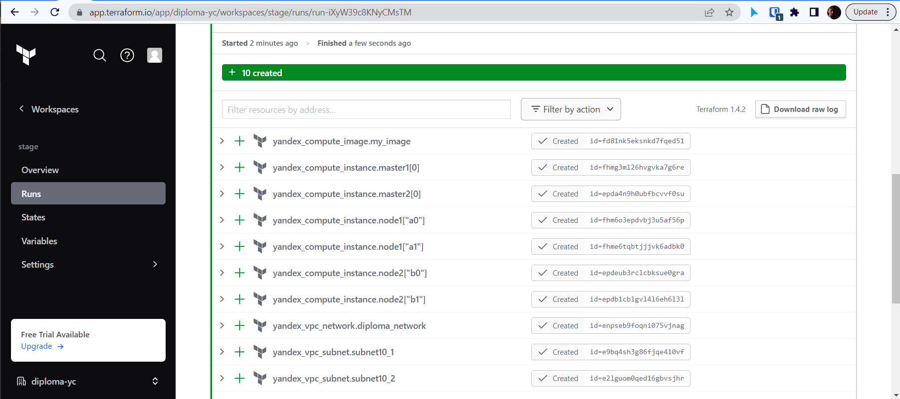

# Этап первый - Создание облачной инфраструктуры

## Цель этапа

На данном этапе в облачном провайдере _YandexCloud_ будет развернута инфрастура из нескольких виртуальных машин при помощи _Terraform_.

1. Для целей реализации дипломного проекта создадим репозиторий на [GitHub](https://github.com/rowhe/devops-diplom-yandexcloud.git) для хранения конфигурационных файлов _всех_ этапов выполнения диплома.
Для конфигурации `Terraform` будем использовать отдельную [директорию](https://github.com/rowhe/devops-diplom-yandexcloud/tree/main/diploma/terraform) в репозитории

2. Создем бэкэнд "diploma-yc" для хранения состояния инфраструктуры при помощи [Terraform Cloud](https://app.terraform.io/):

3. Далее добавлем воркспейс "stage":

3.1 Указываем директорию в репозитории для срабатывания триггера 

4. Также добавим необходимые переменные для подключения к YandexCloud:

5. Вручную запустим создание инфраструктуры

6. Убеждимся, что все сработало и инфраструктура создалась.

## Итог - инфраструктура развернута при помощи `terraform` и готова к установке  кластера `Kubernetes`

## Следующий этап - [развертывание](../ansible/README.md) `Kubernetes` на подготовленной инфраструктуре